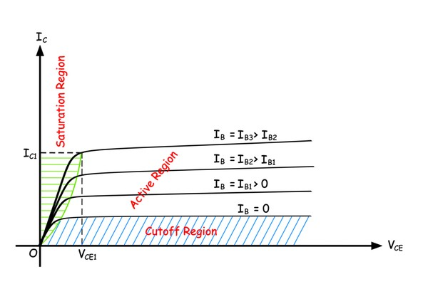
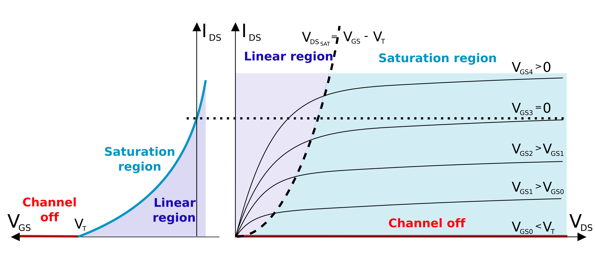
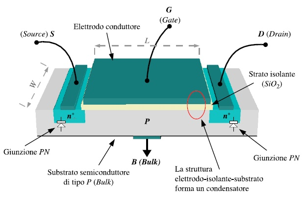

# Dispositivi elettronici

## Semiconduttori

I semiconduttori sono i materiali con cui sono composti i circuiti integrati.
Sono, come suggerisce il nome, materiali in cui il flusso di corrente *non è 
libero* (non è un conduttore), ma è **presente** (non è un'isolante).\newline
In particolare, conducono in particolari situazioni. Quali sono però i
materiali con queste condizioni?

- *Elementi semiconduttori*: Silicio (\ce{Si}), Germanio (\ce{Ge}) (Carbonio (\ce{C}), ma composto)
- *Elementi composti*: \ce{GaAs}, \ce{GaN} (Gallio-Arsenico/Azoto)
In generale sono gli elementi della $14\textdegree$ colonna della tavola periodica o
composti a numero medio di elettroni liberi pari a 4 (dai 3 ai 4).

\begin{redbox}{\emph{Silicio}}
Il silicio è il materiale semiconduttore sicuramente più diffuso. \newline
Un atomo presenta 4 elettroni (detti di \emph{valenza}) nello strato più esterno,
ma sua forma cristallina pura del silicio ogni atomo forma un legame covalente\footnote{legame chimico in cui due atomi mettono in comune delle coppie di elettroni.}
con i suoi vicini "più prossimi".
Il cristallo di silicio puro ha inoltre una struttura cristallina matriciale,
che blocca il passaggio di carica. \newline
È da notare che all'aumentare della temperatura, qualche elettrone può rompere il legame
e muoversi liberamente nel cristallo.
\end{redbox}

Per dotare un materiale semiconduttore di conduttività *selettiva* è necessario
*"drogare"* il materiale stesso.
Il drogaggio, quindi, va a **modificare** la concentrazione di elettroni e di *lacune* [^1],
attraverso questo inserimento di impurità sostituzionali (ovvero atomi di elementi diversi,
i quali si sostituiscono ad alcuni degli atomi di silicio.) \newline
In pratica andiamo ad  aggiungere, in piccole dosi, nel reticolo cristallino materiali della
$5\textdegree$ colonna (drogaggio di tipo **n**, hanno 5 elettroni di valenza, sono detti **donatori**, ad esempio
il fosforo), o elementi della $3\textdegree$ colonna (tipo **p**, hanno 3 elettroni di valenza e sono detti 
**accettori**, ad esempio il boro).\newline
Tale discrepanza induce la formazione di livelli energetici aggiuntivi all'interno della banda 
proibita[^2] o "gap" del semiconduttore. Nel primo caso si genera un eccesso di lacune, le quali
si comportano come particelle cariche *positivamente*, mentre nel secondo si ha un eccesso di elettroni liberi, determinando così una variazione della conducibilità elettrica intrinseca del materiale. \newline
Non solo, sia le lacune che gli elettroni liberi sono quindi liberi di muoversi all'interno del
semiconduttore!\newline
La qualità del semiconduttore è influenzata dal materiale usato (per esempio Ge
è meglio del \ce{Si}, ma è più raro), che è a sua volta influenzato dal goal[^3]
(elettronica digitale usa \ce{Si}, l'elettronica di potenza il \ce{GaN} o \ce{SiC}).

Vediamo ora degli elementi in silicio.

### Giunzione p-n

Una giunzione pn (o p-n) si forma quando una del materiale semiconduttore intrinseco[^4] drogato con un drogaggio p (con
una percentuale $N_{A}$, n. accettori) viene posta a contatto con altro materiale semiconduttore drogato con un drogaggio n
(con una percentuale $N_{D}$, n. donatori). \newline
La concentrazione di ioni dalle seguenti "formule":
$$
N_A = \frac{\# acceptors}{vol. unit} \text{ e } N_D=\frac{\# donors}{vol. unit}
$$
dove $N_a$ indica il numero[^5] di ioni di tipo p:'positivo', mentre $N_d$ il numero di ioni di tipo n:'negativo'.

Collegando un blocco drogato tipo p ed uno tipo n abbiamo (idealmente)[^6]
\begin{figure}[H]
\centering
\begin{tikzpicture}[scale=1.5]
    \draw[very thick](-2,0)--(2,0)--(2,1)--(-2,1)--(-2,0);
    \draw[very thick](0,0)--(0,1);
    \draw[thick](0.5,0)--(0.5,1);
    \draw[thick](-0.5,0)--(-0.5,1);
    \node at (1.25,0.5) {$N$};
    \node at (-1.25,0.5) {$P$};
	 % Aggiungiamo le due righe orizzontali
    \draw[thick](-2.5,0.5)--(-2,0.5);
    \draw[thick](2,0.5)--(2.5,0.5);
    \draw[->](-0.25,0.5)--(0.25,0.5)node[above]{$V_0$};
\end{tikzpicture}
\caption{Giunzione pn}
\end{figure}

Il materiale quindi è separato in due zone _nettamente distinte_, senza alterazione della
struttura cristallina all'interfaccia delle due zone. \newline
L'abbondanza di lacune in p è, come sappiamo, corrispondente ad una carenza di elettroni, di cui n *abbonda*.
In altre parole questa diversa *densità* di portatori di carica genera una **migrazione** di elettroni da N verso P,
detta anche _diffusione[^7] (elettrica)_ $I_D$ oppure anche _corrente di diffusione_, che consiste quindi in

* lacune che si diffondono dalla regione (dal semiconduttore) drogata con p alla regione n;
* elettroni che si diffondono dalla regione drogata con n alla regione p.

> N.B.: Nella zona n i **portatori maggioritari** di carica sono le cariche negative, mentre nella zona p sono le cariche positive

Tale fenomeno carica in modo *positivo* il semiconduttore drogato n (meno elettroni), e in modo *negativo*
il semiconduttore drogato p (più elettroni). \newline
Le lacune che si diffondono dalla regione/zona p alla n si ricombinano con gli elettroni liberi, *scomparendo*. Di conseguenza, il numero di elettroni liberi nella zona n *diminuisce*, quindi non saranno più neutralizzate alcune cariche fisse positive (atomi donatori). Dal momento che questa ricombinazione avviene in prossimità della giunzione, accanto a questa si svilupperà una regione **svuotata** di elettroni, con cariche fisse positive non compensate. \newline
Analogamente nella zona p otterremo una zona svuotata dalle lacune e che comprende delle cariche fisse (in questo caso negative) non compensate.
 
\begin{figure}[H]
\centering
\begin{subfigure}[t]{0.6\textwidth}
\includegraphics[width=\textwidth,height=\textheight,keepaspectratio]{immagini/1.png}
\caption{Regione di svuotamento}
\end{subfigure}
\begin{subfigure}[t]{0.3\textwidth}
\includegraphics[width=\textwidth,height=\textheight,keepaspectratio]{immagini/pn_equilibrio.png}
\caption{Giunzione pn all'equilibrio}
\end{subfigure}
\end{figure}

Entrambe queste zone danno luogo alla **regione di svuotamento**[^8] (o di carica spaziale, in inglese *depletion layer*).
Inoltre lo spostamento delle cariche crea a cavallo della giunzione un campo elettrico, con la zona n positiva rispetto alla zona p. La presenza del campo elettrico comporta la presenza di una differenza di potenziale.
Questa è anche detta **barriera di potenziale**[^9], in quanto si oppone ad un'ulterore diffusione ai portatori di carica soggetti alla spinta della diffusione (si oppone al movimento di elettroni nella regione p e lacune nella regione n).
Una volta che la corrente di diffusione equivale la corrente di trascinamento[^10] $I_S$ raggiungiamo un **equilibrio** (dinamico):
la presenza del campo elettrico comporta la presenza di una differenza di potenziale.\newline
In genere la regione di svuotamento non è simmetrica: la seguente equazione regola la larghezza della regione:
$$
x_p N_A = x_N N_D
$$
dove $x_p$ e $x_n$ sono rispettivamente le **larghezze** della regione di svuotamento entro
il semiconduttore drogato p e drogato n.

\begin{figure}[H]
\includegraphics[height=0.5\textwidth, width=!]{immagini/2.png}
\centering
\caption{Grafici relativi al potenziale, al campo elettrico e alla carica nella giunzione pn}
\label{fig:1.3}
\end{figure}

Come si vede nella @fig:1.3 :

* $N_A > N_D \to$ più è drogata la regione più la regione di svuotamento è piccola. 

## I diodi

Il simbolo circuitale della giunzione p-n, detta **diodo**[^11] è

\begin{figure}[h]
\begin{centering}
\begin{circuitikz}
  \draw (0,0) node[left]{A} to[diode,color=red] (2,0) node[right]{K};
\end{circuitikz}
\caption{Diodo}
\end{centering}
\end{figure}

dove a sinistra abbiamo un **anodo** A (dal greco *salita*), e a destra un **catodo** K 
(dal greco *discesa*).\newline
Sia la zone p che la zona n sono munite di un contatto elettrico (detto **reoforo**),
in modo tale che sia possibile applicarvi una tensione.

### Polarizzazione

L'applicazione di un potenziale sul diodo viene detta **polarizzazione**, e si distingue la:

* Polarizzazione **diretta** (forward bias): applico un potenziale positivo sull'anodo A (lato p) e negativo
sul catodo K (lato n). La differenza di potenziale applicata ha la polarità *concorde* con la barriera di potenziale.
    - L'aumento della tensione determina una riduzione della barriera di potenziale, e di conseguenza della larghezza della
    regione di svuotamento. In questo modo aumenta il numero di elettroni e di lacune capaci di attraversare la giunzione
    tramite la diffusione.
    - La corrente di diffusione, rispetto a quella di deriva, aumenta rapidamente di svariati ordini di grandezza.
\begin{figure}[h]
\begin{centering}
\begin{circuitikz}
  \draw (0,0) node[left]{+} to[diode,color=blue] (2,0) node[right]{-};
\end{circuitikz}
\caption{Diodo polarizzato direttamente}
\end{centering}
\end{figure}
* Polarizzazione **indiretta** (reverse bias): applico un potenziale negativo sull'anodo e positivo sul catodo. In questo
caso la polarità della tensione applicata è discorde rispetto a quella della barriera di potenziale.
    - La regione di svuotamento si allarga, e la tensione di polarizzazione richiama le lacune verso il terminale negativo
    e gli elettroni verso il terminale positivo. Quindi l'ampiezza della barriera di potenziale aumenta.
    - La corrente di diffusione diminuisce fino ad annullarsi, mentre quella di deriva rimane (anche se è molto piccola e
    varia con la temperatura). Quindi quasi nessuna corrente riesce a scorrere.
    - Il campo elettrico incrementa fino ad ottenere il *breakdown*.

\begin{figure}[h]
\begin{centering}
\begin{circuitikz}
  \draw[thick] (0,0) node[left]{-} to[diode,color=orange] (2,0) node[right]{+};
\end{circuitikz}
\caption{Diodo polarizzato indirettamente}
\end{centering}
\end{figure}

### Equazione caratteristica e breakdown

In generale, la giunzione pn ha un'equazione caratteristica
$$
i=I_{S}(e^{\frac{V_d}{nV_t}}-1)
$$
detta **equazione di Shockley**:

* $V_d$ indica la differenza di potenziale applicati ai capi del diodo;
* $nV_t$ è il potenziale nativo dei diodi (pari a $\SI{0.7}{\volt}$), o *tensione termica*, pari a $\SI{26}{\mV}$.
* $I_S$ (o $I_0$) è una costante detta *corrente di saturazione* (per il \ce{Si} ha valori tra $10^{-15}$ e $10^{-19} \, \si{\ampere}$)

In condizioni di polarizzazione diretta la corrente è trascurabile per tensioni al di sotto di $0,5 - 0,6 \si{\volt}$ 
(per diodi al silicio) e dopo aver superato la *tensione di soglia* cresce molto repentinamente[^12]. \newline
Quando il diodo è in polarizzazione inversa, aumentando la tensione la corrente rimane costante finché
non si raggiunge la cosiddetta **tensione di breakdown** (o di rottura). Una volta oltrepassata la corrente
aumenta \colorbox{yellow}{(forse in questo caso \textit{diminuisce})} in maniera drastica a tensione praticamente costante.
\begin{greenbox}{Il \emph{breakdown}}
Il fenomeno del breakdown è dovuto a:
\begin{enumerate}
\item Effetto \emph{Zener}: prevalente per tensioni di breakdown inferiori alla decina di volt. Quando il diodo è polarizzato
    inversamente e la tensione è compresa tra $0\si{\volt}$ e $V_Z$ (inferiore a zero), si comporta quasi come un circuito aperto,
    seppur continui a scorrere una piccola corrente di saturazione inversa, oltre $V_Z$ la banda di valenza della regione p si
    avvicina talmente tanto alla banda di conduzione che alcuni elettroni si spostano dall'una all'altra;
\item Effetto \emph{valanga} (avalanche): prevalente per tensioni di breakdown superiori alla decina di volt. Si manifesta
    in presenza di campi elettrici \emph{molto elevati}, dovuti alla presenza di una tensione "moderata", ma imposta su distanze
    molto corte.
\end{enumerate}

Solitamente il processo del breakdown è irreversibile, tranne per i diodi Zener, i quali sono ideati per andare in breakdown.
\end{greenbox}
\begin{figure}[H]
    \centering
    \includegraphics[width=0.5\textwidth]{immagini/iv_pn.png} % replace with your image file
    \caption{Una tipica caratteristica I-V di un diodo a giunzione PN}
    \label{fig:caratteristica_pn}
\end{figure}

### Diodi Speciali

#### Fotodiodi

I fotodiodi sono diodi in cui la giunzione è "scoperta", o incapsulata in un materiale trasparente, 
in quanto vogliamo che sia in grado di **emettere** una corrente elettrica sfruttando l'effetto fotoelettrico.
Difatti è un *trasduttore*[^13] da un segnale ottico ad un elettrico.
\newline
L'equazione caratteristica del fotodiodo è pari a quella di un diodo normale, con l'aggiunta di un termine
$I_{ph}$, che rappresenta la corrente *fotogenerata*[^14]:
$$
i=I_{S}(e^{\frac{V_d}{nV_t}}-1)-I_{ph}
$$

\begin{center}
\begin{circuitikz}
  \draw (0,0) node[left]{+} to[diode, l_=Diodo normale] (2,0) node[right]{-};
  \draw[pD={}, l_=Fotodiodo] (4,0) node[left]{+} to node[right]{-} (6,0);
\end{circuitikz}
\end{center}

I fotodiodi p-n possono essere utilizzati senza essere polarizzati: sono adatti per "applicazioni" in situazioni
di bassa luminosità. Quando sono illuminati, il campo elettrico nella regione di deplezione aumenta, 
producendo la corrente fotogenerata la quale è cresce all'aumentare del flusso di fotoni. \newline
Altrimenti i fotodiodi operano in *polarizzazione inversa*, in modo tale che i fotoni (del colore "giusto")
possedano energia sufficiente ad oltrepassare la barriera di potenziale e a condurre quindi corrente
elettrica.

#### Led

I **led** (*light emitting diode*) è un tipo di diodo che **converte** energia elettrica in luce.
Sono formati da sottili strati di materiali semiconduttori fortemente drogati, i quali 
caratterizzano i diversi colori emessi quando viene applicata una polarizzazione *diretta*.\newline
Da un punto di vista *costruttivo* i led sono ricoperti da uno strato spesso di resina[^15] **trasparente**
di forma emisferica, sia per proteggere il led stesso sia per convogliare la luce emessa.

\begin{figure}[h]
\centering
\begin{circuitikz}[american]
\draw[pD={}](0.5,-0.5)to(2.0,-0.5);
\end{circuitikz}
\caption{Simbolo circuitale di un led}
\end{figure}

Applicando quindi una tensione positiva all'anodo, riduciamo la barriera di potenziale, in modo
tale che elettroni e lacune ricombinandosi generino fotoni pari al gap tra la banda di conduzione
e quella di valenza.

Come si può vedere nella tabella sottostante, al fine di generare un colore visibile, deve essere
fornita una tensione almeno pari a $1,5 \si{\volt}$

\begin{table}[H]
    \centering
    \begin{tabular}{|c|c|c|c|}
    \hline
        \textbf{Semiconduttore composto} & \textbf{$V_{F}$ a $20$ mA} & \textbf{Banda di lunghezza d'onda} & \textbf{Colore} \\ \hline
        GaInN & 4.0V & 450 nm & Bianco \\ \hline
        SiC & 3.6V & 430-505 nm & Blu \\ \hline
        GaAsP & 22V & 585-595 mm & Giallo \\ \hline
        GaAsP & 2.0V & 605-620nm & Ambra \\ \hline
        GaAsP & 1.8V & 630-660nm & Rosso \\ \hline
        GaAs & 1.2V & 850-940nm & Infrarosso \\ \hline
    \end{tabular}
    \caption{Diverse tipologie di led in base al colore prodotto}
\end{table}

#### Diodo Schottky

In questa tipologia di diodo la giunzione p-n è data dall'unione del metallo (che svolge il ruolo della regione
p) con un materiale semiconduttore drogato n. In questo modo si viene a creare una *"barriera Schottky"*: questa,
a differenza della giunzione p-n standard, ha una *bassa* tensione di giunzione (o tensione di soglia).
Infatti ai capi di un diodo Schottky si misura solitamente una differenza di potenziale tra i $0.15\si{\volt}$ e i
$0,45 \si{\volt}$: così facendo abbiamo una maggior efficienza e una maggior velocità di commutazione, riducendo i tempi
di turnoff[^16]! \newline
Inoltre, nella zona della giunzione del metallo, la zona di svuotamento è **nulla o quasi inesistente**[^17].

\begin{figure}[h]
\centering
\begin{circuitikz}[american]
\draw[sD={}](0.5,-0.5)to(3.0,-0.5);
\end{circuitikz}
\caption{Simbolo circuitale di un diodo Schottky}
\end{figure}

#### Diodo Zener

Questa tipologia di diodo lavora in **breakdown**. Se viene applicata una polarizzazione *diretta*
esso lavora e funziona come un diodo "qualsiasi". Invece, se viene applicata una polarizzazione *inversa*
la tensione di breakdown è "molto precisa": in questo modo se $V_G < V_Z$ non accade nulla $(V_G = V_Z)$,
mentre se $V_G \geq V_Z$ allora il diodo va in breakdown e su esso scorre una corrente. Ho quindi
una tensione di uscita *stabilizzata* $(V_O = V_Z)$.\newline
Nel circuito della figura seguente la resistenza è molto importante, in quanto se non fosse presnete
$i_R = \frac{V_G - V_i}{R}$, ma $R\to0$ e quindi $i_{R}\to \infty$

\begin{figure}[H]
\centering
\resizebox{0.25\textwidth}{!}{%
\begin{circuitikz}
\tikzstyle{every node}=[font=\normalsize]
\draw (0,2.25) to[american voltage source, invert] (0,0.25);
\draw (0,2.25) to[R] (3,2.25);
\draw[zzD={}](3,0.25) to(3,2.25);
\draw (0,0.25) to[short] (3,0.25);
\draw (2.75,2.25) to[short, -o] (4,2.25);
\draw (3,0.25) to (3,0) node[ground]{};
\draw [->, >=Stealth] (1,1.75) -- (2,1.75);
\node [font=\normalsize] at (1.5,1.5) {$i_{R}$};
\node [font=\normalsize] at (0.75,0.75) {$V_{G}$};
\node [font=\normalsize] at (4.5,2.25) {$V_{o}$};
\end{circuitikz}
}%

\label{fig:my_label}
\caption{Schema di un diodo Zener}
\end{figure}

# I transistor

## Introduzione

Un transistor è un dispositivo a semiconduttori utilizzato per interrompere (commutare) o amplificare 
segnali elettrici, come se fosse una **valvola**[^18]: in pratica regola la corrente che scorre
in una maglia (quella in uscita al circuito) tramite la tensione applicata ad un'altra
(ovvero quella in ingresso al circuito). \newline
Quando viene utilizzato come interruttore, un transistor è un dispositivo logico a *due stati*:
ON e OFF (binario 1 e 0). Sulla base di questo vengono realizzate *porte logiche* più complesse,
quali AND, OR, NOT, le quali a loro volta sono impiegate per realizzare tutti quei dispositivi
che compongono la parte **digitale** dell'elettronica (famiglie logiche, memorie etc.). \newline
Invece, quando viene utilizzato come modulatore di corrente, un transistor è a "semplicemente"
un **amplificatore**[^19].

## Bipolar Junction Transistor: i BJT

A differenza dei diodi a giunzione, i *transistor bipolari* utilizzano tre strati di materiali
semiconduttori, in pratica otteniamo due diodi posti in *antiserie*[^20], in modo tale da 
"condividere" uno strato.[^21] \newline
Ad ogni strato sarà associato un *terminale[^22]*: quello che sarà detto **base**, che a sua volta
separa due terminali drogati con gli stessi materiali (opposti al materiale della base), che saranno detti rispettivamente
**collettore** ed **emettitore**. \newline
I dispositivi BJT sono dispositivi *bipolari* in quanto il processo di conduzione coinvolge
portatori di *entrambe le polarità*.
\newline
La struttura di un transistor BJT può essere realizzata in due modi: quello **npn** e quello **pnp**.
È importante notare come in un transistor la zona dell'emettitore è significativamente più 
drogata di quelle di base e di collettore; si indica infatti con p+ nei transistori pnp e con n+ nei transistori npn.

\begin{figure}[H]
\centering
    \begin{subfigure}[b]{0.45\textwidth}
    \centering
    \begin{circuitikz}
        \draw (0,0) node[npn](Q){};
        \draw[thick] (-0.25,0) circle(0.5);
        \draw (-1.5,0)node[left]{$B$}to[short,i=$I_B$,*-](Q.B);
        \draw (0,1.5)node[above]{$C$}to[short,i_=$I_C$,*-](Q.C);
        \draw (Q.E)to[short,i_=$I_E$,-*](0,-1.5)node[below]{$E$};
        
        \draw[->](0.25,-1.375)to[out=45,in=315](0.25,1.375);
        \draw[->](-0.25,-1.5)to[out=180,in=270](-1.5,-0.25);
        \draw[->](-0.25,1.5)to[out=180,in=90](-1.5,0.25);
        \node at (1.3,0){$V_{CE}$};
        \node at (-1.375,-1.375){$V_{BE}$};
        \node at (-1.375,1.375){$V_{CB}$};

    \end{circuitikz}
    \caption{Transistor npn}
    \end{subfigure}
    \begin{subfigure}[b]{0.45\textwidth}
    \centering
    \begin{circuitikz}
        \draw (0,0) node[pnp](Q){};
        \draw[thick] (-0.25,0) circle(0.5);
        \draw (-1.5,0)node[left]{$B$}to[short,i<=$I_B$,*-](Q.B);
        \draw (0,-1.5)node[below]{$C$}to[short,i<=$I_C$,*-](Q.C);
        \draw (Q.E)to[short,i<=$I_E$,-*](0,1.5)node[above]{$E$};
        
        \draw[->](0.25,-1.375)to[out=45,in=315](0.25,1.375);    
        \draw[<-](-0.25,1.5)to[out=180,in=90](-1.5,0.25);
        \draw[<-](-0.25,-1.5)to[out=180,in=270](-1.5,-0.25); %VBC
        \node at (1.3,0){$V_{EC}$};
        \node at (-1.375,1.375){$V_{EB}$};
	    \node at (-1.375,-1.375){$V_{CB}$};
    \end{circuitikz}
    \caption{Transistor pnp}
    \end{subfigure}
    \caption{Transistor BJT}
\end{figure}

\begin{figure}[H]
    \centering
    \begin{subfigure}[b]{0.45\textwidth}
        \centering
        \includegraphics[width=\textwidth]{immagini/npn.png}
        \caption{Caption for image 1}
        \label{fig:image1}
    \end{subfigure}
    \hfill
    \begin{subfigure}[b]{0.45\textwidth}
        \centering
        \includegraphics[width=0.75\textwidth]{immagini/pnp.png}
        \caption{Caption for image 2}
        \label{fig:image2}
    \end{subfigure}
    \caption{Overall caption for the figure}
    \label{fig:subfigures}
\end{figure}

Come è possibile notare dalle figure precedenti, da un punto di vista circuitale i transistor BJT sono rappresentati
utilizzando 3 terminali: $\to$ nel simbolo indica la giunzione (e ne è riportata solo una), mentre
le frecce indicano i versi delle tensioni (dove sono maggiori). Parlando del transistor npn, 
per quanto riguarda le correnti abbiamo che all'equilibrio $I_B + I_C = I_E$, ed $I_B, I_C$ sono
entranti, mentre $I_E$ è uscente.

Per entrambe le tipologie di BJT, da un punto di vista costruttivo valgono queste regole:

1. La regione dell'emettitore è altamente drogata e ha il compito di emettere o iniettare portatori di corrente nella regione di base. Nei transistor npn, l'emettitore di tipo n immette elettroni liberi nella base, mentre nei transistor pnp, l'emettitore di tipo p introduce lacune nella base.
2. La base è sottile e leggermente drogata. La maggior parte dei portatori di corrente iniettati nella regione di base si muove verso il collettore senza fuoriuscire dal conduttore della base.
3. La regione del collettore è moderatamente drogata ed è la più grande all'interno del transistor. La sua funzione consiste nel raccogliere o attrarre i portatori di corrente iniettati nella regione di base.

## Bipolar Junction Transistor: i BJT

Il transistor BJT è stato il primo transistor ad essere prodotto su larga scala, precedendo di una decade l'introduzione dei transistor ad **effetto di campo**.

I BJT sono un dispositivo a semiconduttore a **tre** terminali, realizzato tramite due giunzioni p-n. Sono **bipolari** in quanto il processo di conduzione coinvolge portatori di _entrambe le polarità_: quindi sia lacune che elettroni. \newline
La realizzazione fisica consiste nell'utilizzo di tre strati di materiale semiconduttore, collegati ognuno ad un proprio terminale: abbiamo due strati esterni composti con lo stesso materiale drogante (**collettore** ed **emettitore**), ed un secondo strato posto tra gli altri due all'interno del quale viene introdotto un materiale drogante opposto (**base**). Così facendo otteniamo due giunzioni p-n: una base-emettitore ed una base-collettore.

\begin{redbox}{\emph{Configurazione a diodi}}
In generale un transistor BJT è \textbf{quasi equivalente }a porre due diodi in antiserie\footnote{Antiserie indica, per bipoli polarizzati, una connessione in serie (quindi un solo punto di contatto), in cui le polarità dei terminali vengono accoppiate per segni uguali}. In realtà è più vicina una configurazione di due giunzioni p-n poste l'una di seguito all'altra e orientate in senso inverso (ognuna delle quali con la propria regione di svuotamento). Questo perché per \emph{far funzionare} il transistor BJT è necessaria la presenza di un'\emph{unica} regione di base, che svolge un ruolo cruciale nel controllo della corrente. Quando si affiancano due diodi, l'interazione tra le loro giunzioni non riproduce le caratteristiche di amplificazione e controllo della corrente tipiche di un BJT, in quanto l'introduzione di un metallo nel circuito non permette la corretta gestione delle correnti e delle tensioni necessarie per il funzionamento del transistor: non vi è il campo elettrico necessario a far passare gli elettroni da un diodo all'altro passando per il filo metallico.
\end{redbox}

È possibile realizzare la struttura in due diverse modalità:

- tipo **npn**
- tipo **pnp**

I transistor npn sono usati più frequentemente. Inoltre le regole ed i risultati ottenuti possono essere estesi ai transistor pnp modificando opportunamente i versi di tensioni e correnti.

### Il BJT npn

Un BJT npn è formato da due sezioni di tipo n (emettitore e collettore), e da una di tipo p. 
Di fondamentale importanza per la fabbricazione di un BJT è lo _spessore della base_. Infatti deve essere il più **sottile** possibile, senza fare un corto circuito tra le regioni del collettore e dell emettitore.

In base alle polarizzazioni applicate alle giunzioni base-collettore e base-emettitore, otteniamo 4 **regioni di funzionamento** del transistor BJT:

\begin{table}[h]
\centering
\begin{tabular}{|c|c|c|}
\hline
\multicolumn{2}{|c|}{\textbf{Polarizzazione delle giunzioni}} & \multirow{2}{*}{\textbf{Regione di funzionamento}} \\ \cline{1-2}
\emph{B-E} & \emph{B-C} &  \\ \hline
Inversa & Inversa & Cutoff (Spento) \\ \hline
Diretta & Inversa & Attiva Diretta \\ \hline
Diretta & Diretta & Saturazione \\ \hline
Inversa & Diretta & Attiva Inversa \\ \hline
\end{tabular}
\caption{Regioni di funzionamento in base alla polarizzazione delle giunzioni}
\label{tab:reg-bjt}
\end{table}

#### Regioni di funzionamento

##### Cutoff

In questa regione il transistor è *spento*. Entrambe le giunzioni sono polarizzate inversamente: le rispettive tensioni sono ambedue **sotto soglia**. In particolare $V_{BE}<V_{\text{soglia}}$ e $V_{BC}<0$. \newline
Dato che la giunzione BE non è polarizzata $\to i_B = 0$.
Inoltre, dato che tutte le giunzioni sono polarizzate inversamente, anche la corrente del collettore è *nulla*.
 $\to i_C = 0$ \newline
Nel grafico, la corrente non è esattamente nulla dato che secondo la legge di $I_D$ in una giunzione con polarizzazione inversa la corrente vale $I_O$.

> In definitiva non vi è conduzione.

##### Attiva diretta

In questa regione la giunzione BE è polarizzata *direttamente*, mentre la giunzione BC è polarizzata inversamente. Significa che:

- $V_{BE} > V_{\text{soglia}}$
- $V_{BC} < 0$

La corrente $I_B >0$, e nonostante la tensione della giunzione BC sia negativa, $I_C= h_{fe}I_{b}$. \newline
Dunque gli elettroni dovrebbero ricombinarsi e "richiudersi" verso la base. Tuttavia, sapendo che la base è "corta" gli elettroni raggiungono il collettore prima di ricombinarsi, il quale li prende (forse meglio dire li accetta), in quanto possiede un potenziale *positivo*. È da notare che comunque non tutti gli elettroni riescono ad attraversare tutto il transistor, statisticamente alcuni si ricombinano con le lacune presenti nella regione della base.

Il [^23]**guadagno[^24] del transistor di corrente** è $h_{fe}=\frac{I_C}{I_B}$. Il transistor ha una funzione di *amplificatore* della corrente di base nel caso in cui $h_{fe}$ sia un valore alto: ciò lo rende **_"attivo"_**

> In questa regione funge da generatore di corrente controllato in corrente.

##### Saturazione

In questa regione anche la giunzione BE è polarizzata direttamente:

- $V_{BE}< V_{\text{soglia}}$
- $V_{CE}<V_{CE -sat}$

Se vale quest'ultima condizione (la tensione della giunzione BE è bassa) allora anche BC è polarizzata direttamente. Per lo stesso motivo gli elettroni non vengono "raccolti" dal collettore, tendendo a rimanere nella base: 

- $I_{B}>0$
- $I_C < h_{fe}\ I_{B}$

> È da notare come in questa configurazione/regione otteniamo una tensione in uscita **costante** $V_{CE - sat}$

##### Regione attiva inversa

In questo caso $V_{BE}<0$ e $V_{BC} > V_{\text{soglia}}$. Quindi gli elettroni si spostano nel collettore. In questo caso il *guadagno di corrente è $\leq 1$: $\ I_{e} \simeq - I_{B}$.

> Otteniamo un guadagno di corrente molto basso (tipicamente $\leq 1$)

{width=70%}

In questo grafico sono rappresentate delle curve che riportano gli andamenti di $I_C$ in funzione di $V_{CE}$ con $I_B$.

### Layout planare di un transistor NPN

\begin{figure}[H]
\centering
\resizebox{0.25\textwidth}{!}{%
\begin{circuitikz}
\tikzstyle{every node}=[font=\large]
\draw [thick, fill=blue!20](0,4.25) rectangle (5,0.25);
\draw [thick, fill=red!20]  (1,4.25) rectangle (4,2.25);
\draw [thick, fill=blue!20] (2,4.25) rectangle (3,3.25);
\draw [short] (0,1.25) -- (5,1.25);
\draw [short] (2.5,0.25) -- (2.5,-0.25);
\draw [short] (2.5,4.75) -- (2.5,4.25);
\draw [short] (3.5,4.75) -- (3.5,4.25);
\node [font=\large] at (2.5,0.75) {n+};
\node [font=\large] at (2.5,1.75) {n};
\node [font=\large] at (2.5,2.75) {p};
\node [font=\large] at (2.5,3.75) {n+};
\node [font=\normalsize] at (2.5,5) {Emettitore};
\node [font=\normalsize] at (3.75,5) {Base};
\node [font=\large] at (2.5,-0.5) {Collettore};
\end{circuitikz}
}%
\centering
\caption{Configurazione planare di un BJT npn}
\label{fig:my_label}
\end{figure}

Come mostra anche lo schema, da un punto di vista fisico il layout planare di un transistor BJT npn *non è simmetrico*: questo sia per il drogaggio, sia per la realizzazione del dispositivo stesso. L'emettitore è molto piccolo e molto drogato, mentre le regioni della base e del collettore sono (viceversa) molto grandi e poco drogate. \newline
I contatti della base, dell'emettitore e del collettore sono *metallici* (se legati a zona n viene un diodo di silicio). Dato che i materiali $n^{+}$ sono molto drogati la regione di svuotamento è molto piccola e gli elettroni la possono attraversare come se non ci fosse.

### Il BJT pnp

È un dispositivo *complementare* al pnp: valfolo le stesse equazioni, ma tensioni e correnti sono **opposte** \newline
Sia le prestazioni che il guadagno sono **minori**, perché i portatori in movimento sono le *lacune*, più lente rispetto agli elettroni.

### Transistor "speciali"

#### Foto transistor

Il phototransistor è caratterizzato da una corrente di base *"photo-generated"*[^25]. Il resto dei parametri
di lavoro sono gli stessi un un normale BJT.
$$
I_C = k \cdot P_{L}
$$
dove $P_L$ è la potenza luminosa.\newline
È importante che il dispositivo si trovi in regione attiva: per questo sarà inserito un resistore dal lato del collettore per evitare di andare in saturazione.

\begin{figure}[H]
\centering
\begin{circuitikz}[american]
\draw(1.0,-1.0) node[npn,photo,scale=0.59](Q1){};
\draw[short](Q1.C)to(1.0,-0.5);
\draw[short](Q1.E)to(1.0,-1.5);
\draw(2.0,-1.0) node[pnp,photo,scale=0.59](Q2){};
\draw[short](Q2.E)to(2.0,-0.5);
\draw[short](Q2.C)to(2.0,-1.5);
\end{circuitikz}
\caption{Un fototransistor npn ed uno pnp}
\end{figure}

\begin{figure}[H]
\centering
\resizebox{0.25\textwidth}{!}{%
\begin{circuitikz}
\tikzstyle{every node}=[font=\normalsize]
\draw (0,2) to[R] (0,0);
%\draw (0,0) to[npn, photo] (0,-2);
\draw(0.0, 0.0) node[npn,photo,scale=0.7](0,-3){};
%\draw[short={}](0.0,-2)to(-2.0,-3.0);
\node at (0,2) [circ] {};
\node [font=\normalsize] at (0.5,2) {$V_{CC}$};
\node [font=\normalsize] at (0.5,1) {$R$};
\node [font=\normalsize] at (2.25,0) {$V_{CE} = V_{CC} - R \cdot I > 0.2$};
\end{circuitikz}
}%

\label{fig:my_label}
\caption{Schema con fototransistor npn}
\end{figure}

## I transistor MOS

I **MOSFET** (*Metal Oxide Semiconductor Field Effect Transistor*) sono una tipologia di transistor appartenente ai transistor ad **effetto di campo**: non si basano sulle proprietà delle giunzioni p-n.

\begin{greenbox}{\emph{I transistor ad effetto di campo}}
I transistor ad effetto di campo sono caratterizzati dalla possibilità di controllare la \textbf{conduttività elettrica del dispositivo}, ovvero la quantità di corrente elettrica che attraversa il dispositivo stesso, attraverso la formazione di un \emph{campo elettrico}
all'interno di esso. \newline
Possono essere realizzati in diverse modalità: 
\begin{enumerate}
\item JFET: ovvero Junction-Fet, realizzato con una giunzione p-n come elettrodo "rettificante";
\item MESFET: abbreviazione di Metal Semiconductor FET realizzato tramite una giunzione Schottky raddrizzante metallo-semiconduttore; 
\item MOSFET: il più comune.
\end{enumerate}
\end{greenbox}

I MOS sono strutturati con più *strati di materiali sovrapposti*: metallo, ossido di silicio $(\ce{SiO_2})$ e del silicio, o di tipo $p$ o di tipo $n$. Si utilizza l'ossido come un *isolante*, non permettendo quindi il passaggio di cariche elettriche tra il metallo ed il semiconduttore.\newline
Uno dei pregi dei transistor di tipo *MOS* è il **consumo**: un BJT ha un consumo di energia *costante* nel tempo (dal momento che deve mantenere la polarizzazione), mentre un transistor MOS consuma solo durante le *transizioni*.

Come per i transistor a giunzione, a seconda del drogaggio possiamo ottenere due tipologie diverse di transistor MOS: i nmos e i pmos. \newline
In particolare, sono dispositivi *controllati in tensione*.

### N-MOS

Nell'N-MOS (a canale $P$), il silicio è di tipo $n$: il drogaggio $n+$ favorisce il contatto ohmico[^26] con l'alluminio. Le definizioni delle correnti e delle tensioni equivalgono quelle dei transistor NPN.

\begin{figure}[H]
\centering
\resizebox{0.7\textwidth}{!}{%
\begin{circuitikz}
\tikzstyle{every node}=[font=\LARGE]

\draw[thick, fill=red!20]   (0,7.25) rectangle (11,3.25); %rettangolo principale
\draw[thick, fill=yellow!20]   (4,8.25) rectangle (7,7.25); %ossido
\draw[thick, fill=blue!20]   (2,7.25) rectangle (4,6.25); %n+
\draw[thick, fill=red!60]   (4,9.25) rectangle (7,8.25); %metal gate
\draw[thick, fill=blue!20]   (7,7.25) rectangle  node {\LARGE n+} (9,6.25);%n+
\node [font=\Large] at (5.5,5.25) {P};
\node [font=\Large] at (3,6.75) {n+};
\node [font=\Large] at (5.5,8.75) {Metal gate};
\node [font=\Large] at (5.5,7.75) {Ossido di S};
\node [font=\Large] at (3,8.5) {Source};
\draw [short] (3,8.25) -- (3,7.25);
\draw [short] (8,8.25) -- (8,7.25);
\node [font=\Large] at (8,8.5) {Drain};
\draw [short] (5.5,10.25) -- (5.5,9.25);
\node [font=\Large] at (5.5,10.5) {Gate};
\draw (20,8.5) to[Tnmos, transistors/scale=1.02] (20,4.5);
\draw  (20.25,6.5) circle (1cm);
\draw [<->, >=Stealth] (12,5.75) -- (16,5.75);
\draw [->, >=Stealth] (21.75,5.25) .. controls (22.5,6.5) and (22.25,7.25) .. (21.75,7.75)  node[midway, right] {$V_{CE}$};
\draw [->, >=Stealth] (20,8.5) -- (20,7.5);
\draw [->, >=Stealth] (21,6.5) -- (20.5,6.5);
\draw [->, >=Stealth] (18.5,6.25) -- (19.25,6.25);
\draw [short] (19.25,6.25) -- (19.75,6.25);
\draw [short] (19.75,6.75) -- (19.75,6.25);
\draw [->, >=Stealth] (20,5.5) -- (20,4.75);
\draw [short] (20,4.5) -- (21,4.5);
\node [font=\Large] at (17.75,6.25) {Gate};
\node [font=\Large] at (20,8.75) {Drain $\sim$ D};
\node [font=\Large] at (22.25,4.5) {Source $\sim$ S};
\node [font=\Large] at (20.5,7.75) {$I_D$};
\node [font=\Large] at (20,4) {$I_S$};
\draw [->, >=Stealth] (19.5,4.75) .. controls (18.75,5) and (18.75,5.25) .. (18.25,6)node[midway, right] {$V_{GS}$};
\draw [->, >=Stealth] (17.75,6) -- (17.75,5);
\node [font=\Large] at (17,4.5) {Terminale di controllo};

\node[font=\large, text=blue] at (5.5, 6.75) {- - Canale - -}; 
\end{circuitikz}
}%

\label{fig:my_label}
\caption{Sezione di un transistor N-MOS.}
\end{figure}

È da notare come solitamente il metallo utilizzato sia l'alluminio, anche se a volte può essere del silicio molto drogato. L'ossido, invece, è ossido di silicio.\newline
In generale qualsiasi MOSFET (quindi anche un N-MOS) ha tre terminali: ***source*** (emettitore), ***gate*** (base) e ***drain*** (collettore)[^27].

All'atto pratico si ha la corrente del gate sempre **nulla** (in regime continuo; essenzialmente solo col potenziale "fermo": $i_{G}=\frac{dV}{dt}\cdot C$). L'ossido ha la funzione di isolante, inoltre la lastra (di metallo) è sottile $(\approx 10 nm)$, la quale *blocca*[^28] il passaggio di corrente dal gate al blocco sottostante, formando una struttura di un *condensatore a facce piane*.\newline
Come detto in precedenza la struttura di un transistor N-MOS è simile ad un condensatore, dove le piastre sono il gate, mentre la piastra sotto è l'ossido. Applicando quindi una tensione positiva in GS (tra il gate e il source, $V_{GS}>0$), si accumulano sopra e sotto l'ossido delle cariche (che saranno positive *sopra*, quindi sul gate, e negative *sotto*). Queste cariche andranno a riempire alcune lacune presenti sotto l'ossido, creando così un *depletion layer*.\newline
Come in un condensatore, al crescere della tensione $V_{GS}$ aumenta anche l'accumulo delle cariche; superata una certa ***tensione di soglia*** $V_{T}$ $(V_{GS}>V_T)$, le cariche accumulate hanno riempito tutte le lacune, ed iniziano ad accumularsi sotto l'ossido: così facendo si va creare una regione caratterizzata da una **carica elettrica libera**, che collega S a G. Questa regione è essenzialmente un ***canale*** conduttivo[^29], dove può passare della corrente.

Come il BJT, anche con un transistor N-MOS si hanno diverse ***working regions***:

- ***Cutoff***: il dispositivo è **spento**, in quanto $V_{GS}<V_T$; si ha quindi corrente *nulla* su drain/source, come un interruttore *aperto* $(i_D)=0$;
- ***Linear***: il dispositivo è in **conduzione** $V_{GS}>V_T$; non ha ancora raggiunto la massima corrente (di saturazione, $i_D<i_{D-sat}$). Esiste allora un *rapporto di proporzionalità* $i_D \propto \frac{V_{DS}}{R_{DS}}$; il rapporto tra i due è detto ***resistenza di canale*** ($R_{DS}$) e dipende dalla tensione di Gate. Infatti il dispositivo in questa regione si comporta come un resistore. In questa regione vi è un numero sufficiente di elettroni per far comportare il dispositivo in modo proporzionale, approssimandolo ad un resistore.
- ***Saturation***: il dispositivo è **acceso** $V_{GS}>V_T$, ma ha *saturato*[^30] la corrente $(i_D=I_{sat})$. Questo è dovuto alla tensione di Gate; all'aumentare della tensione $V_{GS}$ , oltre una certa soglia non otteniamo un aumento di corrente, dal momento che il drain D attira più elettroni di quanti ne inserisca S.
Indichiamo le caratteristiche di un MOS con due grafici:

{width=65%}

Come accennato prima abbiamo a che fare con un generatore di corrente *governato in tensione*, in particolare dalla $V_{DS}$, quella tra drain e source. L'*equazione della corrente (di Drain) è*:
$$
i_{D}= \left\{ \begin{array}{cl}
K[2(V_{GS}-V_{T})V_{DS}-V^{2}_{DS})] & : \ V_{DS} \leq V_{GS} - V_{T} \\
i_{D-sat}=k(V_{GS}-V_{T}) & : \ V_{DS} \geq V_{GS} - V_{T}
\end{array} \right.
$$
La prima equazione raffigura una *parabola* che ha come parametro la tensione $V_{DS}$: avrà il proprio vertice in $V_{GS}-V_{T}$. La seconda equazione (che vale nel momento in cui viene raggiunto il vertice della parabola) determina la corrente di saturazione, e diventa una **costante**, con un coefficiente di proporzionalità:
$$
K=\frac{1}{2}\mu\:C_{ox}\frac{W}{L}
$$
dove in $K$, abbiamo più parametri: $mu$ dovrebbe essere la *mobilità*[^31] del materiale, $C_{ox}$ la capacità dell'ossido per unità di carica[^32], mentre $W$ rappresenta la larghezza della zona che va a costituire il canale, mentre $L$ è la lunghezza.
$$
K\propto \mu \Rightarrow K_{n}\simeq 2K_{p}
$$
All'aumentare della corrente il N-MOS si comporta come un resistore la cui resistenza è data
da $R=\frac{\rho\cdot L}{s}=\frac{\rho\cdot L}{W\cdot h}$. Posso quindi riscrivere la costante:
$$
K=\frac{h}{\rho}\cdot\frac{W}{L}
$$
dove la prima parte rappresenta la parte "tecnologica", mentre la seconda è la parte "geometrica" su cui posso agire per *tarare* la risposta di $I_D$ rispetto a $V_{DS}$. Inoltre la lunghezza $L$ determina la distanza tra Drain e Source e di conseguenza la lunghezza del canale: questo è il parametro che va a determinare la tensione massima tra Source e Drain prima di rompere il dispositivo. Questo perché applicando una certa tensione $V_{DS}$ la quale sviluppa un campo elettrico e quanto sono più lontani i terminali quanto più basso è il campo elettrico, e quindi il MOSFET potrà reggere tensioni più alte, e viceversa.\newline
Come nei BJT, una volta superata la cosiddetta tensione di breakdown il dispositivo si rompe; questa tensione è proporzionale al canale.

{width=50%}

### P-MOS

È il dispositivo ***complementare all'N-MOS***. 
\begin{figure}[H]
\centering
\resizebox{0.7\textwidth}{!}{%
\begin{circuitikz}
\tikzstyle{every node}=[font=\LARGE]

\draw[thick, fill=blue!20]   (0,7.25) rectangle (11,3.25); %rettangolo principale
\draw[thick, fill=yellow!20]   (4,8.25) rectangle (7,7.25); %ossido
\draw[thick, fill=red!20]   (2,7.25) rectangle (4,6.25); %n+
\draw[thick, fill=red!60]   (4,9.25) rectangle (7,8.25); %metal gate
\draw[thick, fill=red!20]   (7,7.25) rectangle  node {\LARGE p+} (9,6.25);%n+
\node [font=\Large] at (5.5,5.25) {N};
\node [font=\Large] at (3,6.75) {p+};
\node [font=\Large] at (5.5,8.75) {Metal gate};
\node [font=\Large] at (5.5,7.75) {Ossido di S};
\node [font=\Large] at (3,8.5) {Source};
\draw [short] (3,8.25) -- (3,7.25);
\draw [short] (8,8.25) -- (8,7.25);
\node [font=\Large] at (8,8.5) {Gate};
\node [font=\Large] at (5.5,10.5) {Drain};
\draw [short] (5.5,10.25) -- (5.5,9.25);
\draw [<->, >=Stealth] (12,5.75) -- (15,5.75);
\draw  (4,9.25) rectangle (7,8.25);
\draw (18.75,7.5) to[Tpmos, transistors/scale=1.5] (18.75,4.5);
\draw  (19.25,6) circle (1.1cm);
\draw [->, >=Stealth] (20.75,6.75) .. controls (20.5,7.5) and (20.5,7.75) .. (19.75,7.75) node[pos=0.5,right, fill=white]{$V_{SG}$};
\draw (19.75,6) to[short] (20.5,6);
\draw [->, >=Stealth] (17.5,4.75) .. controls (17,6) and (17,6) .. (17.5,7) node[pos=0.5,left, fill=white]{$V_{SD}$};
\node [font=\large] at (18.75,7.75) {$S$};
\node [font=\large] at (20.75,6) {$G$};
\node [font=\large] at (18.75,4.25) {$D$};
\draw [->, >=Stealth] (18.25,8) -- (18.25,7)node[pos=0.5,left, fill=white]{I};
\draw [->, >=Stealth] (20.5,5.5) -- (21.25,5.5)node[pos=0.5,below, fill=white]{I};
\end{circuitikz}
}%

\label{fig:my_label}
\caption{Sezione di un transistor P-MOS}
\end{figure}

Valgono le stesse equazioni, ma le tensioni e le correnti sono *opposte* ($V_{GS}<0,V_{DS}<0,V_{t}<0$).\newline
Applicando al Ground una tensione negativa si accumulano cariche positive *sotto l'ossido*: si formerà dunque un canale di lacune. Il Drain sarà considerato negativo rispetto al Source.

Il guadagno (e quindi la corrente di uscita) sono *minori*, in quanto le lacune sono portatori minoritari (come per i transistor BJT, in quanto $k_n\approx 2k_p$), le quali andranno a formare il canale di conduzione.

Le equazioni delle curve sono le stesse dell'N-MOS.

Per valutare K dato delle curve è possibile risolvere il seguente sistema:
$$
\begin{cases}
I_{D1}=K(V_{GS}-V_{t})^{2}\\
I_{D2}=K(V_{GS}-V_{t})^{2}\end{cases}\longrightarrow\begin{cases}\sqrt{I_{DS}}=\sqrt{K}(V_{GS}-V_{t})\\
\sqrt{I_{DS}}=\sqrt{K}(V_{GS}-V_{t})
\end{cases}
$$

\begin{bluebox}{Riepilogo dei transistor MOS}
I MOS hanno le seguenti regioni:
\begin{enumerate}
\item Quando la tensione di Gate è inferiore alla tensione di soglia ($V_{G}<V_{th}$ entrambe in valore assoluto), siamo in \emph{cutoff}: non abbiamo portatori nel canale. Siamo in interdizione ed il dispositivo è spento e non passa corrente tra source e drain;
\item Nella regione \emph{lineare}, in cui ci troviamo superando la tensione di soglia per piccole tensioni di drain, la (curva) caratteristica della corrente è \emph{parabolica}: inizialmente si potrebbe approssimare con una retta (da qui lineare). La pendenza di quest'ultima mi indica la resistenza del canale, tant'è che il dispositivo viene detto \emph{\textbf{resistore controllato in tensione}} (di Gate)! Sono inversamente proporzionali.
\item Una volta raggiunto il vertice della parabola ci troviamo nella regione detta \emph{di saturazione} la corrente diventa \textbf{costante} e sempre dipendente dalla tensione di Gate: il transistor è un generatore di corrente controllato in tensione.
\end{enumerate}
\end{bluebox}

### Real N-MOS

All'apparenza il transistor N-MOS sembra un dispositivo *simmetrico*, ma non lo è. Infatti in precedenza abbiamo assunto la tensione $V_{DS}>0$ perché polarizzando la S viene polarizzato anche il blocco P[^33] sottostante: in questo modo si viene a formare un ***body diode*** tra l'emettitore ed il collettore. In sostanza si va a *cortocircuitare* (viene metallizzato) Source con la regione di tipo P: rimane la giunzione tra P e il Drain.
\begin{redbox}{Body diode} 
Il \textbf{body diode} (o di bulk) sono diodi \textbf{\emph{intrinseci}} per qualsiasi transistor ad effetto di campo. Nelle applicazioni FET a canale N, la corrente scorre tipicamente dal drain alla source a causa della polarità del body diode. Anche se non è stato indotto un canale, la corrente può comunque fluire dalla source al drain attraverso la connessione in cortocircuito source-body e il diodo body-drain. Per questo motivo, un tipico FET a canale N non può bloccare il flusso di corrente dalla sorgente al drain.
\end{redbox}
Nel nostro caso è essenzialmente una giunzione p-n *parassita* in cui passa la corrente invece che nel canale.

\begin{figure}[h!]
  \centering
  \begin{minipage}{0.45\textwidth}
    \centering
    \resizebox{0.6\textwidth}{!}{ % Ridimensiona la figura al 80% della larghezza
      \begin{circuitikz}
        \tikzstyle{every node}=[font=\LARGE]
        \draw  (1,7.25) rectangle (10,3.25);
        \draw  (4,8.25) rectangle (7,7.25);
        \draw  (2,7.25) rectangle (4,6.25);
        \draw  (7,7.25) rectangle  node {\LARGE n+} (9,6.25);
        \node [font=\Large] at (5.5,5.25) {P};
        \node [font=\Large] at (3,6.75) {n+};
        \node [font=\Large] at (5.5,8.75) {Metal gate};
        \node [font=\Large] at (5.5,7.75) {Ossido di S};
        \node [font=\Large] at (3,8.5) {Source};
        \draw [short] (3,8.25) -- (3,7.25);
        \draw [short] (8,8.25) -- (8,7.25);
        \node [font=\Large] at (8,8.5) {Gate};
        \draw [short] (5.5,10.25) -- (5.5,9.25);
        \node [font=\Large] at (5.5,10.5) {Drain};
        \draw  (4,9.25) rectangle (7,8.25);
        \draw (5.5,3.25) to[D] (8,6.25);
      \end{circuitikz}
    }
    \caption{Presenza nel real N-MOS del body diode}
  \end{minipage}
  \hspace{1cm}
  \begin{minipage}{0.45\textwidth}
    \centering
    \begin{circuitikz}
      \draw (0,0) node[nigfete](M1){};
      \draw (M1.G) -- (-1,0) node[left]{Gate};
      \draw (M1.D) -- (0,1.2) node[above]{Drain};
      \draw (M1.S) -- (0,-1.2) node[below]{Source};
      \draw (1,-1) to[diode] (1,1);
      \draw (0,-1) to[short] (1,-1);
      \draw (0,1) to[short] (1,1);
    \end{circuitikz}
    \caption{Schema circuitale del real N-MOS}
  \end{minipage}
\end{figure}

Se $V_{DS}<0$ il diodo in questione è in *forward bias*, e la corrente $i_D$ non dipende più dal gate[^34]: non abbiamo quindi più il controllo sul dispositivo, perché la corrente scorre nel diodo indipendentemente dalla tensione applicata sul Gate. Per evitarlo la tensione di Drain dovrebbe essere maggiore rispetto a quella di Source.

Il P-MOS reale funziona al contrario.

# Digital Logic Circuits (circuiti a logica digitale)

Servono per trasferire e processare informazioni tra dispositivi **senza modificare i valori**, funzionano realizzando operazioni *booleane* su dati booleani.

## Famiglie logiche

\begin{redbox}{Definizione: famiglie logiche}
Una \textbf{famiglia logica} è un insieme di dispositivi elettronici i quali, se connessi tra di loro in modo opportuno, permettono di realizzare una qualsiasi funzione logica. Queste sono funzioni che definiscono lo stato di un'uscita per ogni possibile configurazione degli stati.
\end{redbox}

### Operatori logici (booleani)

- **NOT** (negazione): restituisce il bit negato.

\begin{figure}[h!]
  \centering
  \begin{minipage}{0.45\textwidth}
    \centering
    % Porta NOT con A e $\overline{A}$
    \begin{circuitikz}
      \node [not port](O1) at (0,0) {};    % Porta NOT
      \node at (-1, 0) {A};                 
      \node at (1, 0) {$\overline{A}$};     
    \end{circuitikz}
    \caption{Simbolo circuitale di NOT con A e $\overline{A}$}
  \end{minipage}%
  \hspace{0.5cm} % Spazio tra le due sottofigure
  \begin{minipage}{0.45\textwidth}
    \centering
    % Tabella di verità per NOT senza l'ambiente table
    \begin{tabular}{l|l}
      A & $\overline{A}$ \\ \hline
      0 & 1              \\
      1 & 0             
    \end{tabular}
    \caption{Tabella di verità per NOT}
  \end{minipage}
\end{figure}

- **AND** (prodotto logico): restituisce vero se *entrambi i bit sono veri*.

\begin{figure}[h!]
  \centering
  \begin{minipage}{0.45\textwidth}
    \centering
    % Porta AND con A e B
    \begin{circuitikz}
      \node [and port](O1) at (0,0) {};    % Porta AND
      \node at (-2, 0.25) {A};                % A a sinistra
      \node at (-2, -0.3) {B};                 % B a destra
      \node at (0.75, 0) {A$\cdot$B};                 % B a destra
    \end{circuitikz}
    \caption{Simbolo circuitale di AND con A e B}
  \end{minipage}%
  \hspace{0.5cm} % Spazio tra le due sottofigure
  \begin{minipage}{0.45\textwidth}
    \centering
    % Tabella di verità per AND
    \begin{tabular}{c|c|c}
    A & B & A+B  \\ 
    \hline
    0 & 0 & 0    \\
    1 & 0 & 0    \\
    0 & 1 & 0    \\
    1 & 1 & 1   
    \end{tabular}
    \caption{Tabella di verità per AND}
  \end{minipage}
\end{figure}

- **OR** (somma logica): restituisce vero se *almeno un bit è vero*.

\begin{figure}[h!]
  \centering
  \begin{minipage}{0.45\textwidth}
    \centering
    % Porta AND con A e B
    \begin{circuitikz}
      \node [or port](O1) at (0,0) {};    % Porta OR
      \node at (-2, 0.25) {A};                % A a sinistra
      \node at (-2, -0.3) {B};                 % B a destra
      \node at (0.75, 0) {A+B};                 % B a destra
    \end{circuitikz}
    \caption{Simbolo circuitale di AND con A e B}
  \end{minipage}%
  \hspace{0.5cm} % Spazio tra le due sottofigure
  \begin{minipage}{0.45\textwidth}
    \centering
    % Tabella di verità per AND
    \begin{tabular}{c|c|c}
    A & B & A+B  \\ 
    \hline
    0 & 0 & 0    \\
    1 & 0 & 1    \\
    0 & 1 & 1    \\
    1 & 1 & 1   
    \end{tabular}
    \caption{Tabella di verità per AND}
  \end{minipage}
\end{figure}

Concatenando queste porte logiche è possibile costruire una *qualsiasi operazione logica complessa*.

### Leggi (o teoremi) di de Morgan

Servono a stabilire relazioni di equivalenza tra la congiunzione (AND) e la disgiunzione (OR) logica: attraverso la negazione (NOT) è possibile esprimere queste due porte logiche in *termini reciproci*. Le leggi sono le seguenti
\begin{align*}
\tag{1}A+B=\overline{\overline{A}\cdot\overline{B}}&\Longrightarrow \overline{A+B}=\overline{A}\cdot\overline{B} \\
\tag{2}A\cdot B=\overline{\overline{A}+\overline{B}}&\Longrightarrow\overline{A\cdot B}=\overline{A}+\overline{B}
\end{align*}
A parole:

- La legge $(1)$ dice che effettuare la negazione dell'operazione di AND tra due ingressi equivale all'OR tra la negazione dei due singoli ingressi;
- Allo stesso modo la legge numero $(2)$ ci dice che la negazione dell'operazione OR tra i due ingressi equivale alla somma tra gli stessi ingressi negati singolarmente.

A questo punto possiamo ricavare due porte:

- **NAND**: o "NOT AND", è un dispositivo complementare alla porta AND. Per le leggi di Morgan un NAND equivale all'operazione di OR tra due ingressi negati.
\begin{figure}[h!]
  \centering
  \begin{minipage}{0.45\textwidth}
    \centering
    % Porta NAND con A e B
    \begin{circuitikz}
      \node [nand port](O1) at (0,0) {};    % Porta NAND
      \node at (-2, 0.25) {A};                % A a sinistra
      \node at (-2, -0.3) {B};                % B a destra
      \node at (0.75, 0) {$\overline{A\cdot B}$}; % Etichetta per NAND
    \end{circuitikz}
    \caption{Simbolo circuitale di NAND con A e B}
  \end{minipage}%
  \hspace{0.5cm} % Spazio tra le due sottofigure
  \begin{minipage}{0.45\textwidth}
    \centering
    % Tabella di verità per NAND
    \begin{tabular}{c|c|c|c|c|c}
    A & B & $\overline{A}$ & $\overline{B}$ & A $\cdot$ B & $\overline{A\cdot B}$ \\ 
    \hline
    0 & 0 & 1 & 1 & 0 & 1    \\
    1 & 0 & 0 & 1 & 0 & 1    \\
    0 & 1 & 1 & 0 & 0 & 1    \\
    1 & 1 & 0 & 0 & 1 & 0   
    \end{tabular}
    \caption{Tabella di verità per NAND}
  \end{minipage}
\end{figure}

- **NOR**: o "NOT OR", è il dispositivo complementare alla porta OR. Sempre per le leggi di Morgan un NOR equivale all'operazione AND fra due ingressi negati

\begin{figure}[h!]
  \centering
  \begin{minipage}{0.45\textwidth}
    \centering
    % Porta NOR con A e B
    \begin{circuitikz}
      \node [nor port](O1) at (0,0) {};    % Porta NOR
      \node at (-2, 0.25) {A};                % A a sinistra
      \node at (-2, -0.3) {B};                % B a destra
      \node at (0.75, 0) {A + B};             % Etichetta per NOR
    \end{circuitikz}
    \caption{Simbolo circuitale di NOR con A e B}
  \end{minipage}%
  \hspace{0.5cm} % Spazio tra le due sottofigure
  \begin{minipage}{0.45\textwidth}
    \centering
    % Tabella di verità per NOR con A, B, A negato, B negato, A AND B e A NOR B
    \begin{tabular}{c|c|c|c|c|c}
    A & B & $\overline{A}$ & $\overline{B}$ & A + B & $\overline{A + B}$ \\ 
    \hline
    0 & 0 & 1 & 1 & 0 & 1    \\
    1 & 0 & 0 & 1 & 1 & 0    \\
    0 & 1 & 1 & 0 & 1 & 0    \\
    1 & 1 & 0 & 0 & 1 & 0   
    \end{tabular}
    \caption{Tabella di verità per NOR}
  \end{minipage}
\end{figure}
\begin{bluebox}{Osservazione: \emph{completezza} della famiglia logica}
Una famiglia logica si dice \emph{\textbf{completa}} quando tra i suoi dispositivi è presente la porta NOT ed una tra la porta AND o la porta OR. In particolare è possibile realizzare, con le porte NAND e NOR, tutte le porte precedenti: in questo modo quindi \emph{\textbf{si possono realizzare tutti i circuiti con una singola porta!}}
\end{bluebox}

- Esempi:
\begin{figure}[H]
\centering
\begin{subfigure}{0.45\textwidth}
\centering
\resizebox{\textwidth}{!}{%
\begin{circuitikz}
\tikzstyle{every node}=[font=\large]
\draw (4,15) to[short] (4.75,15);
\draw (4,14.5) to[short] (4.75,14.5);
\draw (4.75,15) node[ieeestd nand port, anchor=in 1, scale=0.89](port){} (port.out) to[short] (7,14.75);
\draw (4,15) to[short] (3,15);
\draw (3.5,15) to[short] (3.5,14.5);
\draw (3.5,14.5) to[short] (4,14.5);
\node [font=\large] at (2.5,15) {$A$};
\node [font=\large] at (8,14.75) {$\overline{A \cdot A} = \overline{A}$};
\end{circuitikz}
}
\caption{Porta NOT con NAND}
\label{not_nand}
\end{subfigure}
\hfill
\begin{subfigure}{0.45\textwidth}
\centering
\resizebox{\textwidth}{!}{%
\begin{circuitikz}
\tikzstyle{every node}=[font=\large]
\draw (4,15) to[short] (4.75,15);
\draw (4,14.5) to[short] (4.75,14.5);
\draw (4.75,15) node[ieeestd nor port, anchor=in 1, scale=0.89](port){} (port.out) to[short] (7,14.75);
\draw (4,15) to[short] (3,15);
\draw (3.5,15) to[short] (3.5,14.5);
\draw (3.5,14.5) to[short] (4,14.5);
\node [font=\large] at (2.5,15) {$A$};
\node [font=\large] at (8,14.75) {$\overline{A + A} = \overline{A}$};
\end{circuitikz}
}
\caption{Porta NOT con NOR}
\label{not_nor}
\end{subfigure}
\caption{Rappresentazioni della porta NOT.}
\label{fig:not}
\end{figure}

\begin{figure}[H]
\centering
\begin{subfigure}{0.45\textwidth}
\centering
\resizebox{\textwidth}{!}{%
\begin{circuitikz}
\tikzstyle{every node}=[font=\normalsize]
\draw (1,19.25) to[short] (1.25,19.25);
\draw (1,18.75) to[short] (1.25,18.75);
\draw (1.25,19.25) node[ieeestd nand port, anchor=in 1, scale=0.89](port){} (port.out) to[short] (3,19);
\draw (3,19) to[short] (4,19);
\draw (5,19.25) to[short] (5.25,19.25);
\node [font=\normalsize] at (3.75,19.2) {$A\cdot B$};
\draw (5,18.75) to[short] (5.25,18.75);
\draw (5.25,19.25) node[ieeestd nand port, anchor=in 1, scale=0.89](port){} (port.out) to[short] (7,19);
\draw (4.5,19.25) to[short] (5,19.25);
\draw (4.5,18.75) to[short] (5,18.75);
\draw (4,19) to[short] (4.5,19);
\draw (4.5,18.75) to[short] (4.5,19.25);
\node [font=\normalsize] at (0.75,19.25) {A};
\node [font=\normalsize] at (0.75,18.75) {B};
\node [font=\normalsize] at (9.5,19) {$\overline{\overline{AB} \cdot \overline{AB}} = AB + AB = AB$};
\end{circuitikz}
}
\caption{Porta AND con NAND}
\label{and_nand}
\end{subfigure}
\hfill
\begin{subfigure}{0.45\textwidth}
\centering
\resizebox{\textwidth}{!}{%
\begin{circuitikz}
\tikzstyle{every node}=[font=\normalsize]

\draw (0,32.5) to[short] (0.25,32.5);
\draw (0,32) to[short] (0.25,32);
\draw (0.25,32.5) node[ieeestd nor port, anchor=in 1, scale=0.89](port){} (port.out) to[short] (2,32.25);
\draw (0,30.5) to[short] (0.25,30.5);
\draw (0,30) to[short] (0.25,30);
\draw (0.25,30.5) node[ieeestd nor port, anchor=in 1, scale=0.89](port){} (port.out) to[short] (2,30.25);
\draw (-1,32.5) to[short] (0,32.5);
\draw (-0.5,32.5) to[short] (-0.5,32);
\draw (-0.5,32) to[short] (0,32);
\draw (-1,30.5) to[short] (0,30.5);
\draw (-0.5,30.5) to[short] (-0.5,30);
\draw (-0.5,30) to[short] (0,30);
\draw (3,31.5) to[short] (3.25,31.5);
\draw (3,31) to[short] (3.25,31);
\draw (3.25,31.5) node[ieeestd nor port, anchor=in 1, scale=0.89](port){} (port.out) to[short] (5,31.25);
\draw (2,32.25) to[short] (2.5,32.25);
\draw (2.5,32.25) to[short] (2.5,31.5);
\draw (2.5,31.5) to[short] (3,31.5);
\draw (2,30.25) to[short] (2.5,30.25);
\draw (2.5,31) to[short] (2.5,30.25);
\draw (2.5,31) to[short] (3,31);
\node [font=\normalsize] at (-1.2,32.5) {A};
\node [font=\normalsize] at (-1.2,30.5) {B};
\node [font=\normalsize] at (3,31.75) {$\overline{A}$};
\node [font=\normalsize] at (3,30.75) {$\overline{B}$};
\node [font=\normalsize] at (6.5,31.25) {$\overline{(\overline{A}+\overline{B})}=A\cdot B$};
\end{circuitikz}
}
\caption{Porta AND con NOR}
\label{and_nor}
\end{subfigure}
\caption{Rappresentazioni della porta AND.}
\label{fig:and}
\end{figure}
\begin{figure}[H]
\centering
\begin{subfigure}{0.45\textwidth}
\centering
\resizebox{\textwidth}{!}{%
\begin{circuitikz}
\tikzstyle{every node}=[font=\normalsize]
\draw (0,34.5) to[short] (0.25,34.5);
\draw (0,34) to[short] (0.25,34);
\draw (0.25,34.5) node[ieeestd nand port, anchor=in 1, scale=0.89](port){} (port.out) to[short] (2,34.25);
\draw (0,32.5) to[short] (0.25,32.5);
\draw (0,32) to[short] (0.25,32);
\draw (0.25,32.5) node[ieeestd nand port, anchor=in 1, scale=0.89](port){} (port.out) to[short] (2,32.25);
\draw (3,33.5) to[short] (3.25,33.5);
\draw (3,33) to[short] (3.25,33);
\draw (3.25,33.5) node[ieeestd nand port, anchor=in 1, scale=0.89](port){} (port.out) to[short] (5,33.25);
\draw (2,34.25) to[short] (2.5,34.25);
\draw (2.5,34.25) to[short] (2.5,33.5);
\draw (2.5,33.5) to[short] (3,33.5);
\draw (2,32.25) to[short] (2.5,32.25);
\draw (2.5,33) to[short] (2.5,32.25);
\draw (2.5,33) to[short] (3,33);
\draw (-0.5,34.5) to[short] (0.25,34.5);
\draw (-0.25,34.5) to[short] (-0.25,34);
\draw (-0.25,34) to[short] (0.25,34);
\draw (-0.5,32.5) to[short] (0,32.5);
\draw (-0.25,32.5) to[short] (-0.25,32);
\draw (-0.25,32) to[short] (0.25,32);
\node [font=\normalsize] at (-0.75,34.5) {$A$};
\node [font=\normalsize] at (-0.75,32.5) {$B$};
\node [font=\normalsize] at (2.25,34.5) {$\overline{A}$};
\node [font=\normalsize] at (2.25,32) {$\overline{B}$};
\node [font=\normalsize] at (6.5,33.25) {$\overline{\overline{A}\cdot\overline{B}}=A+B$};
\end{circuitikz}
}
\caption{Porta OR con NAND}
\label{or_nand}
\end{subfigure}
\hfill
\begin{subfigure}{0.45\textwidth}
\centering
\resizebox{\textwidth}{!}{%
\begin{circuitikz}
\tikzstyle{every node}=[font=\normalsize]
\draw (1,3.5) to[short] (1.25,3.5);
\draw (1,3) to[short] (1.25,3);
\draw (1.25,3.5) node[ieeestd nor port, anchor=in 1, scale=0.89](port){} (port.out) to[short] (3,3.25);
\draw (5,3.5) to[short] (5.25,3.5);
\draw (5,3) to[short] (5.25,3);
\draw (5.25,3.5) node[ieeestd nor port, anchor=in 1, scale=0.89](port){} (port.out) to[short] (7,3.25);
\draw (3,3.25) to[short] (4,3.25);
\draw (4,3.25) to[short] (4.5,3.25);
\draw (5,3) to[short] (4.5,3);
\draw (4.5,3) to[short] (4.5,3.5);
\draw (4.5,3.5) to[short] (5,3.5);
\node [font=\normalsize] at (0.75,3.75) {$A$};
\node [font=\normalsize] at (0.75,3) {$B$};
\node [font=\normalsize] at (3.75,3.5) {$\overline{A+B}$};
\node [font=\normalsize] at (9.4,3.25) {$(\overline{\overline{A}+\overline{B}})=\overline{\overline{A+B}}=A+B$};
\end{circuitikz}
}
\caption{Porta OR con NOR}
\label{or_nor}
\end{subfigure}
\caption{Rappresentazioni della porta OR.}
\label{fig:or}
\end{figure}
In elettronica, lo stato logico $0$ è associato ad una *bassa tensione*, mentre lo stato $1$ è associato ad un'*alta tensione*.

## Famiglie logiche: parametri statici

Quando si tratta un segnale logico, ci si aspetta che esso sia ___ben definito___: in particolare deve essere ben chiaro quando il segnale è "alto" e quando è basso. Per ogni famiglia logica quindi esistono quindi una serie di parametri che ne definiscono il funzionamento. I seguenti parametri sono detti statici in quanto sono misurati con il circuito "fermo", senza commutazioni: non dipendono dal fatto che il segnale stia variando nel tempo.

1) **Tensione di ingresso**: discrimina il valore *logico* in base alla tensione d'ingresso, quindi come questa sia *interpretata*:
    - $V_{iL} \doteq$ è il __massimo__ valore di tensione in ingresso che la famiglia logica rileva come _livello logico basso_ (oppure $0$ logico, stato negativo);
    - $V_{iH} \doteq$ è il __minimo__ valore di tensione in ingresso che la famiglia logica (o l'integrato) percepisce come _livello logico alto_ (oppure $1$ logico, stato positivo).
   
2) **Tensione di uscita**: indica come interpretare i valori rilevati all'uscita di un circuito:
    - $V_{oL} \doteq$ è il **massimo** valore della tensione in uscita da una porta logica[^35] dalla porta logica tale che, in base alle specifiche del prodotto, corrisponde ad un livello logico **basso** ($0$ logico);
    - $V_{oH} \doteq$ è il **minimo** valore della tensione in uscita da una porta logica che in base alle specifiche del prodotto stabilisce un valore logico **alto** ($1$ logico).

\begin{orangebox}{Nota: Regione di indeterminazione.}
Per evitare ambiguità devono valere:
$$
V_{iL}\leq V_{iH}; \quad V_{oL}\leq V_{oH}
$$
Idealmente tutti i valori in ingresso \emph{corrispondono} ai valori in uscita. Tuttavia questo non è possibile, a causa di possibili variazioni ambientali e/o nel processo di costruzione. Si usano quindi dei valori $V_{i/o L}$ più bassi dei $V_{i/oH}$, statisticamente \emph{certi}, i quali considerano anche le possibili oscillazioni dei valori. Questo perché rispettando questi valori definiti del costruttore del circuito in tutte le condizioni operative il segnale sarà interpretato/percepito \textbf{correttamente}. \newline
Infatti sappiamo che un qualsiasi valore di tensione di ingresso compreso tra $\left[\mathrm{V}_{\mathrm{iL-max}},\mathrm{V}_{\mathrm{iH-min}}\right]$ non sappiamo quando potrà essere riconosciuto dalla porta come 1 logico o come 0 logico: si dice che sono valori nella \emph{\textbf{regione di indeterminazione}}. Inoltre, per una far sì che non ci siano errori di interpretazione è necessario che l'operazione di commutazione tra gli stati sia il più \emph{veloce} possibile, in quanto il valore in questi casi passa nella regione.\newline Allo stesso modo, un qualsiasi valore di tensione di uscita compreso nell'intervallo $[\mathrm{V}_{\mathrm{oL-max}},\mathrm{V}_{\mathrm{oH-min}}]$ non potrà essere riconosciuto con 1 logico o come 0 logico da una porta posta immediatamente in cascata.
\begin{minipage}{\linewidth}
\centering
\resizebox{0.3\textwidth}{!}{%
\begin{circuitikz}
\tikzstyle{every node}=[font=\small]
% Disegna le linee orizzontali
\draw [short] (0,2) -- (4,2);
\draw [short] (0,0) -- (4,0);
% Colora la zona tra le due linee orizzontali
\fill[blue, opacity=0.2] (0,0) rectangle (4,2);
% Aggiungi le etichette
\node [font=\footnotesize] at (2,1) {\textit{Regione di Indeterminazione}};
\node [font=\normalsize] at (4.5,2) {$V_{iH}$};
\node [font=\normalsize] at (4.5,0) {$V_{iL}$};
\end{circuitikz}
}%
\end{minipage}
\end{orangebox}

3) **Corrente assorbita**:
    - $I_{iH}$: corrente assorbita in ingresso quando viene applicato il valore logico alto;
    - $I_{iL}$: corrente assorbita in ingresso quando viene applicato il valore logico basso.

Da queste grandezze ne derivano altre 3:

4) **Noise Margin**[^36]: resilienza del circuito al rumore; quanto disturbo può ricevere *senza influire sul suo comportamento*. È la quantità cui il segnale eccede la soglia minima $V_{iH}$ e
$V_{iL}$:
    $$
    NM=\min(NM_{H}, NM_{L}); \quad NM_{H}=V_{oH}-V_{iH}; \quad NM_{L}=V_{iL}-V_{oL}
    $$
\begin{bluebox}{Osservazione}
$NM_{H}$ e $NM_{L}$ devono essere \textbf{positivi}, per cui è necessario che le tensioni siano:
$$
V_{oH}>V_{iH};\quad V_{iL}>V_{oL}
$$
Maggiore è la differenza tra i valori (e quindi il Noise Margin), maggiore è il grado di "certezza" dell'interpretazione del segnale.
\end{bluebox}
5) **Fan-out**[^36]: rappresenta il ***massimo numero di porte d'ingresso*** che posso guidare/pilotare (collegabili ad un'uscita) mantenendo un valore logico *corretto* (dipende da $I_{i\:L},\:I_{i\:H}$);
6) **Static power**[^37]: rappresenta la ***potenza assorbita (o dissipata) in condizioni statiche***. È pari alla media tra le potenze assorbite con un'uscita alta/bassa;
    $$
    P=\frac{(P_{H}+P_{L})}{2}
    $$
dove $P_H = V_{cc}\cdot i_H$ e $P_L=V_{cc}\cdot i_L$.    

## Famiglie logiche: parametri *dinamici*.
I parametri precedenti devono essere misurati in condizioni *statiche*, mentre questi si misurano ***al momento di una commutazione di stato***[^38].

1) **Ritardo/tempo di propagazione** (propagation delay): indicato con $t_{p_{HL}}$ e $t_{p_{LH}}$, rappresenta in quanto tempo un cambio in ingresso è *percepito* (e riportato) dall'uscita. È fondamentale che sia **basso**: ad esempio con $10\:ns$ siamo vincolati a processi con frequenza massima di $100$ MHz; tra i due tempi di propagazione conta quello **più lento**, ovvero quello più penalizzante.
2) **Energia di commutazione** (Switching power): indica l'energia impiegata (in Joule) per commutare uno stato, essa cresce *linearmente* con la velocità del circuito (lower better). Viene integrata per il tempo della commutazione;
3) **Prodotto ritardo-potenza** (Delay-Power product): è il prodotto tra il ritardo di propagazione e la potenza dissipata nel circuito; serve per *bilanciare* le prime due, le quali sono tra loro discordi (lower better). A livello del design del circuito si può aumentare la potenza e di conseguenza diminuirà il ritardo di propagazione (a parità di circuito). La potenza dipende dalle resistenze, mentre il ritardo dalle capacità.

## RTL (Resistor-Transistor Logic)
È una famiglia di porte logiche *che usano i transistor BJT* e resistenze per realizzare le porte. Il sistema è obsoleto a causa del suo fan-in limitato (al massimo 3 ingressi). Alcuni esempi di porte sono:

- **NOT**: Corrisponde ad un transistor con una resistenza di base $R_B$ e una resistenza di collettore $R_C$, l'ingresso è collegato alla base del transistor; il dispositivo si comporta come un *invertitore*. In questa configurazione, ovvero quando l'emettitore è collegato a massa, si parla di emettitore comune. 

\begin{figure}[H]
\centering
\resizebox{0.5\textwidth}{!}{%
\begin{circuitikz}[american]
    % Resistor RB
	\draw node[american not port] at (1, 5) {};
    \draw [R=,a={$R_B$}, l={$450\:\Omega$}] (6, 5) to (3, 5);
    % Ground node
    \draw node[ground] (N1) at (7, 2.75) {} node[anchor=south west] at (N1.north east) {$0$};
    % Transistor Q1
    \draw node[npn] (N2) at (7, 5) {} node[anchor=south east] at ([xshift=0.56cm, yshift=-0.56cm]N2.north west) {$Q1$};
    % Connect the nodes
    \draw (6.16, 5) -- (6.25, 5) -- (6, 5); % Simplified
    \draw (7, 4.23) -- (7, 2.75); % Simplified
    % Resistor RC
    \draw (7, 8) to[R, a=$R_C$,l=$640\:\Omega$] (7, 5.77);
    % Connection for 5V
    \draw (7, 9) -- (7, 8); % Simplified
    % Connection from Q1 to output
    \draw (7, 5.77) -- (9, 5.75); % Simplified
    % Input node
    \draw node[ocirc] (N3) at (3, 5) {} node[anchor=east] at (N3.west) {$IN$};
    % Output node
    \draw node[ocirc] (N4) at (9, 5.77) {} node[anchor=west] at (N4.text) {$OUT$};
    % 5V node
    \draw node[ocirc] (N5) at (7, 9) {} node[anchor=south] at (N5.north) {$5V$};
    \draw[->, >=Stealth] (6, 7.5) -- (6, 6.25) node[pos=0.5, left] {$i$};
	\draw node[circ] at (7, 5.77) {};
	\draw[->, >=Stealth](7.25, 5.5) -- (7.25, 4.75) node[pos=0.5, right]{$i_{C}$};
\end{circuitikz}}
\caption{Porta NOT realizzata con RTL.}
\end{figure}

- **NOR**: in questo caso mettiamo due stadi d'ingresso uguali, collegandoli alla stessa resistenza di collettore.

\begin{figure}[H]
\centering
\resizebox{0.7\textwidth}{!}{%
\begin{circuitikz}[american]
	% Paths, nodes and wires:
	\draw node[american nor port] at (1.386, 5.47) {};
	\draw (8.16, 5.5) to[R,l={$R_B$},a={$450\:\Omega$}] (4, 5.5);
	\draw node[npn] (N1) at (9, 5.5) {} node[anchor=south east] at ([xshift=0.51cm, yshift=-0.51cm]N1.north west){$Q_1$};
	\draw (10, 5.5) to[R, l={$R_B$},a={$450\:\Omega$}] (14.16, 5.5);
	\draw node[npn] (N2) at (15, 5.5) {} node[anchor=south east] at ([xshift=0.49cm, yshift=-0.49cm]N2.north west){$Q_2$};
	\draw[draw] (9, 7) -| (9, 6.25) -| (9, 7) -- (17, 7);
	\draw[crossing={}](15, 6.27) to (15, 7.75);
	\draw (15, 10) to [R,a={$R_C$},l={$640\:\Omega$}] (15, 7.75);
	\draw node[ground] at (9, 4) {};
	\draw node[ground] at (15, 4) {};
	\draw[draw] (9, 4.73) -| (9, 4);
	\draw[draw] (15, 4.75) -| (15, 4);
  	\draw node[ocirc] (N3) at (4, 5.5) {} node[anchor=east] at (N3.west){$IN-A$};
	\draw node[ocirc] (N4) at (17, 7) {} node[anchor=west] at (N4.east){$OUT=\overline{A+B}$};
	\draw node[ocirc] (N5) at (15, 10) {} node[anchor=south] at (N5.north){$5V$};
	\draw node[ocirc] (N6) at (10, 5.5) {} node[anchor=north] at ([yshift=-0.07cm]N6.south){$IN-B$};
\end{circuitikz}}
\caption{Porta NOR realizzata con RTL.}
\end{figure}

#### Lista parametri RTL

1) Statici:
	* $V_{iH} = 0.75V, V_{iL} = 0.6V$ 
	* $I_{iH} @ V_{iH} = 150 \mu A, I_{iH} @ 5V = 9.5mA$: la $@$ indica che viene stabilita la corrente $I_{iH}$ con la tensione $V_{H}$ stabilita.
	* $I_{iL} \simeq 0$: è circa zero se l'ingresso è basso, in quanto la giunzione BE è spenta:
	* $V_{oH} = 5V$: (no load condition, ___senza carico___, ovveor se non si collega nulla) 
	* $V_{oL} = 0.2V$: pari alla tensione di saturazione
	$$
	\text{Per valutare } I_{iH} = \left\{ \begin{array}{cl}
	V_{iH} & =\ V_{IN} = 0,75 V \text{ e } V_{BE}\simeq 0,6V\\
	I_{iH} & =\ I_{B} \text{ e } I_{B}\cdot R_{B}+V_{BE}=V_{IN}\\
	\end{array} \right.
	$$
    Il range d'ingresso va dai $5V$ alla tensione $V_{iH}=0,75V$, con $5=V$ tensione di alimentazione della porta.
2) Dinamici:
	* $NM_{H} = 4.25V, NM_{L} = 0.4V \to NM = 0.4V$
	* Fan-out: 33
	* $P_{L} = 5V\times 7.5mA (Rc) = 37.5mW, P_{H} = 0, P =18mW$ 
	* $t_{pHL}$ e $t_{pH}$ veloci per merito della resistenza in base (si tratta di qualche nS) 
	* $DP$ = 5nS\times 18mW = 90pJ$
	* Il fanout si calcola facendo: $(V_{CC}-V_{iH})/R_{C}=n\times I_{iH}($@$V_{iH})$.

### Funzione di trasferimento della porta NOT

Analizziamo il funzionamento della porta logica NOT. 

- Se la tensione in ingresso $V_{in}$ è *bassa*, la corrente $i_C$ è nulla e la corrente $i$ va tutta in OUT.
- Se la tensione in ingresso $V_{in}$ è *alta*, si ha che $i_{C}\leq h_{fe}\cdot i_{B}$: la corrente non può andare tutta in uscita.

Analizzando il circuito inserendo dei valori: se nell'ingresso, ovvero nella base, non abbiamo corrente (quindi $I_{B}=0$), il transistor sarà in **interdizione** (in cutoff) e non passerà corrente, $I_{C}=0$. La tensione in uscita sarà di conseguenza $V_{out}=5V- R_{C}$.\newline
Se invece in ingresso abbiamo una tensione in ingresso alta (per esempio $5V$), posso ipotizzare che la giunzione base-emettitore sia polarizzata direttamente e che quindi a cavallo tra la $R_B$ e la messa a terra ci siano $0,7V$, mentre che sulla resistenza si misura $4,3V$. La corrente che entra in base è circa $10\:mA$: di conseguenza il transistor è in __saturazione__ e quindi $V_{CE}=V_{CE-sat}=0,2V$[^39].

\begin{figure}[h] \centering \begin{subfigure}{.45\textwidth}
\includegraphics[width=\textwidth]{assets/imgs/grafico_not_rtl.png}
\caption{Grafico della porta NOT RTL.}
\label{fig:subfig1} \end{subfigure}
\hspace*{\fill}
\begin{subfigure}{.45\textwidth}
\includegraphics[width=\textwidth]{assets/imgs/ingrandimento_grafico_not.png}
\caption{Ingrandimento tra $0,5 V$ e  $1V$} \label{fig:subfig2}
\end{subfigure}
\caption{Grafici sulla funzione di trasferimento} \label{fig:grafici rtl_not}
\end{figure}

Bisogna però stabilire se la famiglia logica sia "buona" o meno tramite i valori di $V_{iH}$ e $V_{iL}$. Per far ciò utilizziamo un simulatore di circuiti elettrici, all'interno del quale sono inseriti sia i parametri che la descrizione del circuito stesso e farne un grafico. Il primo rappresenta della funzione di trasferimento della porta NOT, ottenuto. Il grafico si dice **statico**, in quanto non è presente la variabile temporale. Sull'asse delle ascisse è presente la tensione in ingresso, mentre sulle ordinate è presente la tensione di uscita. \newline
Sappiamo dal grafico che esso rappresenta la porta NOT in quanto se l'ingresso è basso, l'uscita è alta e viceversa (sopra certi valori). In una zona tra gli $0,5V$ e $0,7V$ si ha la commutazione.\newline
Il secondo grafico è un ingrandimento del primo, viene evidenziata la zona della commutazione: a $600mV$ viene definito il punto in cui la giunzione base emettitore si accende. Ciò significa che si sta accendendo anche il transistor (sta iniziando a polarizzarsi), quindi scorre corrente in base e di conseguenza anche sulla resistenza di collettore, e la tensione (del collettore) in uscita diminuisce (drasticamente). Quindi dai $700mV$ il transistor è in saturazione, ma vogliamo dare alla tensione in ingresso minimo $750mV$. Abbiamo quindi trovato $V_{iH}$ e $V_{iL}$.
La tensione in uscita $V_{oL}$ è semplice trovarla sugli $\approx 0,2V = V_{CE-sat}$, mentre $V_{oH}$ è più particolare, perché senza nessun carico è pari a $5V$. \newline
Osserviamo inoltre che il noise margin è particolarmente basso, dovuto alla differenza tra i valori delle tensioni associati agli stati logici bassi.

#### Calcolo del Fan-out

Sappiamo che all'uscita di un transistor si possono collegare più ingressi: potenzialmente un numero $n$

\begin{figure}[H]
    \centering
    \resizebox{0.5\textwidth}{!}{\input{assets/graphs/fanout_rtl.tex}}
    \caption{Uscita per calcolo fanout: da un transistor si collegano n ingressi, composti da una resistenza ed una giunzione base-emettitore}
\end{figure}

* Se vogliamo un valore _alto_ su $V_{OUT}$, questo deve essere pari (condizione limite) alla tensione $V_{iH}=0,75V$. Inoltre:
\begin{align*}
\left. \begin{array}{l} 
V_{RC}=5-0,75 \: V=4,25 V \\
R_{C}=640\Omega
\end{array} \right\} 
\Longrightarrow 
I_{out}=\frac{4,25V}{640\Omega}=6,6\:mA \\
I_{iH}@0,75V=150\:\mu A \Longrightarrow \frac{6,6\:mA}{150\:\mu A}=44 \text{ porte logiche.}
\end{align*}
che rispetto al valore espresso sul datasheet, ovvero 33, è maggiore. Tuttavia si utilizza quest'ultimo valore al fine di lasciare un po' di margine al circuito (considerando $I_H=200\mu A$)
* Per avere un valore _basso_ su $V_{out}$: se l'uscita bassa con corrente $I_{iL}\simeq 0$, teoricamente non vi è un limite sul numero di porte logiche.

#### Calcolo della potenza statica
- Potenza dissipata se l'uscita è _bassa_:
\begin{align*}
\left. \begin{array}{l} 
V_{RC}=5-0,2 \: V=4,8 V \\
i_{C}=\frac{4,8\:V}{640\Omega}=7,5\:mA
\end{array} \right\} 
\Longrightarrow 
P_{L}=5\:V\cdot 7,5\:mA=37,5\:mW
\end{align*}
- Potenza dissipata se l'uscita è _alta_:
\begin{align*}
V_{out}=5\:V\Longrightarrow V_{RC}=0\Longrightarrow I_{C}=0\Longrightarrow P_{H}=0\:mW
\end{align*}
Si considera carico ___nullo___: la porta non è collegata ad altre porte.

#### Tempi di propagazione:
- $t_{p_{HL}}$ è pari al tempo necessario a polarizzare la giunzione p-n: pochi nS;
- $t_{p_{LH}}$ è pari al tempo necessario a rimuovere i portatori minoritari dalla base, ovvero il tempo necessario a spegnere la giunzione p-n: pochi nS;

L'ultimo parametro dinamico è il _Delay-power product_: $DP=5\:ns\cdot 18\:mW=90\:pJ$

\begin{redbox}{Osservazione}
Se incrementiamo la resistenza di base (aumentando da $450\Omega$) \emph{diminuisce la potenza ma aumenta il tempo}.\newline
Tuttavia i valori scelti per le resistenza ottimizzano le prestazioni di tutta la famiglia logica RTL.
\end{redbox}
\begin{orangebox}{Problemi della famiglia RTL}
Uno dei problemi principali della famiglia logia RTL è il fatto che lo stadio d'ingresso formato da una resistenza e dalla giunzione base-emettitore assorbe molta corrente in un verso e non ne assorbe nell'altro.
\end{orangebox}

## TTL (transistor-transistor-logic)
È una famiglia logica successiva alla famiglia RTL, ed è più _evoluta_: le porte logiche in questo caso sono realizzati utilizzando una ___coppia di transistori___:
\begin{figure}[H]
    \centering
    \resizebox{0.4\textwidth}{!}{\input{assets/graphs/basic_not.tex}}
    \caption{Porta NOT "semplice" in TTL.}
\end{figure}

#### Porta __Basic NOT__: 
Durante le transizioni dallo stato basso ad alto i portatori minoritari presenti in Q2 vengono rimossi dal transistor Q1; se l'ingresso della porta logica è __basso/spento__ (ad esempio la tensione in ingresso $V_{in}=0,2V$) la giunzione base-emettitore Q1 sarà accesa (grazie alla resistenza RPU, resistenza di pull-up, che porta i $5V$ in ingresso) e quindi scorre della corrente in base nel transistor Q1. La giunzione può essere in regione attiva diretta oppure in saturazione: tuttavia per essere in regione attiva dovrebbe esserci un ingresso di corrente nel collettore di Q1, ma in condizioni stazionarie ciò non accade perché per la disposizione del transistor Q2 non scorre corrente verso il collettore, quindi Q1 si trova in saturazione. Di conseguenza la tensione sulla base del transistor Q2 (= tensione di collettore di Q1) sarà pari a $V_{in}+0,2V=0,2V$, che è troppo _bassa_ per accendere il transistor Q2: per questo motivo tutta la corrente andrà in uscita.
\begin{greenbox}{Memo}
La giunzione base-collettore è anch'essa assimilabile ad un diodo, per cui ha il suo massimo potenziale a $\approx 0,7V$
\end{greenbox}
A causa delle oscillazioni dei valori la tensione in $V_{B}=0-0,75V$, mentre la tensione sul collettore $V_{C}=0-1,5V$. Se invece abbiamo un ingresso alto (tensione in ingresso $V_{in}=5V$), Q1 si troverà in regione attiva inversa, con gain quasi nullo.
\begin{figure}[H]
    \centering
    \resizebox{0.4\textwidth}{!}{\input{assets/graphs/basic_not_v2.tex}}
    \caption{Porta NOT "semplice" con Q1 diodo.}
\end{figure}
Q1 diventa assimilabile ad un diodo, mandando tutta la corrente verso la base del transistor Q2: in questo modo essa va in saturazione, ottenendo un'uscita bassa (come nella porta NOT nella logica RTL). È da notare che attraverso Q1 la corrente di scarica di Q2 viene aumentata considerevolmente e di conseguenza si potrà spegnere velocemente: la transizione dell'uscita da basso ad altro è molto veloce.
\begin{redbox}{In sintesi:}
\begin{itemize}
\item Transizioni dallo stato basso ad alto \emph{veloci}, dato che il transistor Q1 aiuta a smaltire le cariche minoritarie immagazzinate da Q2;
\item L'uscita deve comunque essere tirata verso l'alto\footnote{Aumentare la tensione o portare un segnale verso un valore più alto.} da $R_C$
\item L'ingresso assorbe corrente sole se basso, ed è in funzione di $RPU$
\end{itemize}
\end{redbox}

#### Enhanced NOT
Viene disegnato un nuovo circuito per migliorare le prestazioni: in particolare l'uscita, se positiva, non è governata dal transistor, ma dalla resistenza di collettore.\newline
Consideriamo quindi un circuito migliorato:
\begin{figure}[H]
    \centering
    \resizebox{0.5\textwidth}{!}{\input{assets/graphs/enhanced_not.tex}}
    \caption{Enhanced NOT.}
\end{figure}
Genera due segnali _complementari_: se il collettore è alto l'emettitore è basso e viceversa.

# Esercizi

\begin{bluebox}{Le leggi di Kirchoff}
\begin{enumerate}
\item \emph{Legge di Kirchoff alle correnti}: la somma delle correnti in un nodo è pari a 0.
\item \emph{Legge di Kirchoff alle tensioni}: la somma delle tensioni lungo un percorso chiuso è pari a0.
\end{enumerate}
\end{bluebox}

## Esercizi capitolo 1

\begin{figure}[h]
\centering
\begin{circuitikz}[american]
\draw[V={}](2.0,-2.5)to(2.0,-5.5);
\draw[D={}](2.0,-2.5)to(6.5,-2.5);
\draw[R={}](6.5,-2.5)to(6.5,-5.5);
\draw[short={}](2.0,-5.5)to(6.5,-5.5);
\end{circuitikz}
\end{figure}

# Varie 

## Semiconduttori e bande

Gli elettroni in un solido allo stato fondamentale e a temperatura $0$ kelvin, in obbedienza alla
loro natura fermionica e al principio di Pauli che preclude ai fermioni il fatto di potersi
trovare in due nello stesso stato, riempiono gli stati elettronici loro consentiti partendo
dal livello energetico più basso via via su, fino a che tutti gli elettroni del solido hanno
trovato un'accomodazione. Si distribuiscono cioè rispettando la distribuzione di Fermi-Dirac
calcolata a temperatura 0 kelvin. Nei metalli, il livello energetico più alto occupato si 
definisce livello di Fermi.

{width=50%}

A questo punto possono verificarsi diverse possibilità:

* Vi è una banda, o più di una fra le ultime riempite da elettroni, che è parzialmente riempita
e restano degli stati vuoti. In tal caso si ha a che fare con un metallo, cioè un sistema in cui
gli ultimi elettroni hanno la possibilità di spostarsi in livelli energetici molto vicini,
infinitesimalmente più alti in energia, e dunque hanno la possibilità di una mobilità elevata
che porta il sistema ad essere un buon conduttore di elettricità.
* L'ultima banda è stata riempita completamente in modo tale che il prossimo stato elettronico
consentito si trovi sulla banda successiva e fra questa banda e la banda completamente riempita
c'è una banda proibita (_band gap_) di energie. In tal caso il solido è un dielettrico.
* Si parla infine di semiconduttore nel caso di un isolante in cui la banda proibita è talmente
piccola che a temperatura ambiente c'è una certa probabilità che gli elettroni si trovino a
saltare la banda proibita per agitazione termica, e dunque il sistema si trovi in una situazione
prossima a quella di un metallo, con valori di conducibilità elettrica non nulli.

(N.B paragrafo proveniente da [Wikipedia][link1])

[link1]: https://it.wikipedia.org/wiki/Struttura_elettronica_a_bande 

\begin{comment} 
TODO capire come funziona tavola periodica
## Tavola periodica

%%\pgfPT[show title=false, back color scheme=example,
%%  legend box={draw=blue!50,fill=blue!20},
%%  show extra legend,
%%  Z list={5,7,13,14,15,31,32,33,49,51}]
\end{comment}

## Corrente nel N-MOS
A differenza del transistor BJT, dove la base è comunque ristretta, abbiamo in pratica due giunzioni p-n tra la base e il source oppure con il drain: quindi è come se ci fossero due diodi contrapposti. Infatti ciò spiega il perché in prima approssimazione non scorre corrente tra Source e Drain (in condizione di quiete).

## Termini

- $V_{cc}$: è la tensione di alimentazione positiva che fornisce energia a un circuito elettronico associata al collettore; sta per "Voltage at the Common Collector" (tensione al collettore comune), che è il punto di riferimento per le tensioni di alimentazione nei circuiti a transistor bipolari (BJT).

<!-- Elenco note a piè di pagina -->

[^1]: Assenza di elettroni dovuta alla **rottura** di un legame. È insieme all'elettrone, un portatore di carica nei semiconduttori.

[^2]: Intervallo di energia interdetto agli elettroni, distanza tra la banda di valenza di conduzione (nei semiconduttori distanti $1\si{eV}$).

[^3]: (penso voglia dire "obiettivo perseguito").

[^4]: Puro, quindi privo di un quantitativo significativo di drogaggio.

[^5]: Oppure densità di ioni, o concentrazione...

[^6]: Nella pratica parto da un blocco puro di silicio, per poi iniettare a *strati* il drogaggio.

[^7]: Fenomeno che si ritrova in natura qualora vi sia uno squilibrio nella distribuzione nello spazio di particelle simili.

[^8]: Svuotata di portatori **mobili**

[^9]: È possibile superarla, ma deve essere fornita una differenza di potenziale **esterna**.

[^10]: Detta anche corrente di deriva (drift), in questo caso i portatori si muovono perché **spinti** dal campo elettrico dovuto allo squilibrio di carica.

[^11]: Il diodo ideale è un dispositivo che lascia passare corrente solo in un senso, con resistenza nulla, e non lascia passare corrente nell’altro senso. Il diodo a giunzione approssima molto bene un diodo ideale, ed è l'elemento circuitale non lineare più importante.

[^12]: Per un aumento di corrente di un fattore mille è sufficiente un aumento di tensione pari a $\SI{0.8}{\volt}$. Infatti viene assunta $\SI{0.6}{\volt}$ come tensione di soglia e $\SI{0.8}{\volt}$ come tensione massima.

[^13]: Dispositivo in grado di convertire una forma di energia in una diversa.

[^14]: Risulta proporzionale al flusso di fotoni che colpiscono il fotodiodo

[^15]: Epossidica, in inglese *epoxy*.

[^16]: Tempo che passa tra la fine dell'influenza esterna (forward bias) ed il momento in cui smette di fluire corrente. È un ritardo causato dalla carenza di lacune ($N_D >> N_A$), causando un accumulo extra di carica in p, la quale sarà rilasciata durante il turnoff.

[^17]: Dal lato p.

[^18]: Infatti sono andate a sostituire le *valvole termoioniche*, o *tubo a vuoto*.

[^19]: Può essere sia un amplificatore di potenza che di tensione.

[^20]: Antiserie indica, per bipoli **polarizzati**, una connessione in serie (quindi un solo punto di contatto), in cui le polarità dei terminali vengono accoppiate per segni uguali

[^21]: Oppure possiamo anche dire che sono due giunzioni p-n poste l'una di seguito all'altra e orientata in senso inverso, andando poi a costituire tre regioni *consecutive*. 

[^22]: Si può esprimere anche come *elettrodo*

[^23]: È una funzione di.

[^24]: In inglese è **gain**.

[^25]: In questo caso la corrente di base è sostituita dall'intensità luminosa. 

[^26]: Un *contatto ohmico* è una giunzione elettrica tra un metallo e un semiconduttore che non ha proprietà rettificanti (non trasforma un segnale alternato in uno continuo). La caratteristica principale è avere una curva corrente-tensione $I-V$ lineare, come prevista dalla legge di Ohm.

[^27]: Di solito la regione di silicio drogato più grande (ad esempio la regione p nel N-MOS), viene detta *bulk*.

[^28]: Infatti anche per quanto riguarda lo schema del circuito il gate è isolato rispetto agli altri due terminali.

[^29]: Inizialmente la sua proprietà principale è quella di "essere una resistenza".

[^30]: Ha raggiunto la massima corrente.

[^31]: Quanto *scorrono* facilmente le cariche al suo interno.

[^32]: Più è maggiore più ha possibilità di spostare cariche.

[^33]: O $n$ se in un P-MOS.

[^34]: Nel transistore P-MOS accade se la tensione tra drain e source $V_{DS}>0$

[^35]: La porta successiva potrà riconoscerlo.

[^36]: Più è alto meglio è; *higher better*.

[^37]: Più bassa è meglio è; lower better.

[^38]: Quindi la porta logica cambia dallo stato alto al basso o viceversa.

[^39]: Se non torna rileggere parte BJT.
