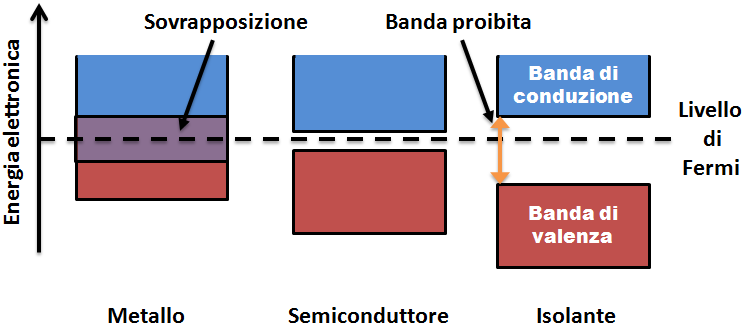

# Dispositivi elettronici

## Semiconduttori

I semiconduttori sono i materiali con cui sono composti i circuiti integrati.
Sono, come suggerisce il nome, materiali in cui il flusso di corrente *non è 
libero* (non è un conduttore), ma è **presente** (non è un'isolante).

In particolare, conducono in particolari situazioni. Quali sono però i
materiali con queste condizioni?

- *Elementi semiconduttori*: Silicio (\ce{Si}), Germanio (\ce{Ge}) (Carbonio (\ce{C}), ma composto)
- *Elementi composti*: \ce{GaAs}, \ce{GaN} (Gallio-Arsenico/Azoto)
In generale sono gli elementi della $14°$ colonna della tavola periodica o
composti a numero medio di elettroni liberi pari a 4 (dai 3 ai 4).

\begin{mybox}{\emph{Silicio}}
Il silicio è il materiale semiconduttore sicuramente più diffuso. \newline
Un atomo presenta 4 elettroni (detti di \emph{valenza}) nello strato più esterno,
ma sua forma cristallina pura del silicio ogni atomo forma un legame covalente
\footnote{legame chimico in cui due atomi mettono in comune delle coppie di elettroni.}
con i suoi vicini "più prossimi".
Il cristallo di silicio puro ha inoltre una struttura cristallina matriciale,
che blocca il passaggio di carica. \newline
È da notare che all'aumentare della temperatura, qualche elettrone può rompere il legame
e muoversi liberamente nel cristallo.
\end{mybox}

Per dotare un materiale semiconduttore di conduttività *selettiva* è necessario
*"drogare"* il materiale stesso.
Il drogaggio, quindi, va a **modificare** la concentrazione di elettroni e di *lacune* [^1],
attraverso questo inserimento di impurità sostituzionali (ovvero atomi di elementi diversi,
i quali si sostituiscono ad alcuni degli atomi di silicio.) \newline
In pratica andiamo ad  aggiungere, in piccole dosi, nel reticolo cristallino materiali della
$5°$ colonna (drogaggio di tipo **n**, hanno 5 elettroni di valenza, sono detti **donatori**, ad esempio
il fosforo), o elementi della $3°$ colonna (tipo **p**, hanno 3 elettroni di valenza e sono detti 
**accettori**, ad esempio il boro).\newline
Tale discrepanza induce la formazione di livelli energetici aggiuntivi all'interno della banda 
proibita[^2] o "gap" del semiconduttore. Nel primo caso si genera un eccesso di lacune, le quali
si comportano come particelle cariche *positivamente*, mentre nel secondo si ha un eccesso di elettroni liberi,
determinando così una variazione della conducibilità elettrica intrinseca del materiale. \newline
Non solo, sia le lacune che gli elettroni liberi sono quindi liberi di muoversi all'interno del
semiconduttore!

La qualità del semiconduttore è influenzata dal materiale usato (per esempio Ge
è meglio del \ce{Si}, ma è più raro), che è a sua volta influenzato dal goal[^3]
(elettronica digitale usa \ce{Si}, l'elettronica di potenza il \ce{GaN} o \ce{SiC}).

Vediamo ora degli elementi in silicio.

[^1]: Assenza di elettroni dovuta alla **rottura** di un legame. È insieme all'elettrone, un portatore di carica nei semiconduttori.
[^2]: Intervallo di energia interdetto agli elettroni, distanza tra la banda di valenza di conduzione (nei semiconduttori distanti $1\si{eV}$).
[^3]: (penso voglia dire "obiettivo perseguito").

### Giunzione p-n

Una giunzione pn (o p-n) si forma quando una del materiale semiconduttore intrinseco [^4] drogato con un drogaggio p (con
una percentuale $N_{A}$, n. accettori) viene posta a contatto con altro materiale semiconduttore drogato con un drogaggio n
(con una percentuale $N_{D}$, n. donatori). \newline
La concentrazione di ioni dalle seguenti "formule":
$$
N_A = \frac{\# acceptors}{vol. unit} \text{ e } N_D=\frac{\# donors}{vol. unit}
$$
dove $N_a$ indica il numero[^5] di ioni di tipo p:'positivo', mentre $N_d$ il numero di ioni di tipo n:'negativo'.

[^4]: Puro, quindi privo di un quantitativo significativo di drogaggio.
[^5]: Oppure densità di ioni, o concentrazione...

Collegando un blocco drogato tipo p ed uno tipo n abbiamo (idealmente)[^6]

\begin{figure}[H]
\centering
\begin{tikzpicture}[scale=1.75]
    \draw[very thick](-2,0)--(2,0)--(2,1)--(-2,1)--(-2,0);
    \draw[very thick](0,0)--(0,1);
    \draw[thick](0.5,0)--(0.5,1);
    \draw[thick](-0.5,0)--(-0.5,1);
    \node at (1.25,0.5) {$N$};
    \node at (-1.25,0.5) {$P$};
	 % Aggiungiamo le due righe orizzontali
    \draw[thick](-2.5,0.5)--(-2,0.5);
    \draw[thick](2,0.5)--(2.5,0.5);
    \draw[->](-0.25,0.5)--(0.25,0.5)node[above]{$V_0$};
\end{tikzpicture}
\caption{Giunzione pn}
\end{figure}

Il materiale quindi è separato in due zone _nettamente distinte_, senza alterazione della
struttura cristallina all'interfaccia delle due zone. \newline

[^6]: Nella pratica parto da un blocco puro di silicio, per poi iniettare a *strati* il drogaggio.

L'abbondanza di lacune in p è, come sappiamo, corrispondente ad una carenza di elettroni, di cui n *abbonda*.
In altre parole questa diversa *densità* di portatori di carica genera una **migrazione** di elettroni da N verso P,
detta anche _diffusione[^7] (elettrica)_ $I_D$ oppure anche _corrente di diffusione_, che consiste quindi in

* lacune che si diffondono dalla regione (dal semiconduttore) drogata con p alla regione n;
* elettroni che si diffondono dalla regione drogata con n alla regione p.

> N.B.: Nella zona n i **portatori maggioritari** di carica sono le cariche negative, mentre nella zona p sono le cariche positive

Tale fenomeno carica in modo *positivo* il semiconduttore drogato n (meno elettroni), e in modo *negativo*
il semiconduttore drogato p (più elettroni). \newline
Le lacune che si diffondono dalla regione/zona p alla n si ricombinano con gli elettroni liberi, *scomparendo*. Di conseguenza,
il numero di elettroni liberi nella zona n *diminuisce*, quindi non saranno più neutralizzate alcune cariche fisse positive
(atomi donatori). Dal momento che questa ricombinazione avviene in prossimità della giunzione, accanto a questa si svilupperà
una regione **svuotata** di elettroni, con cariche fisse positive non compensate. \newline
Analogamente nella zona p otterremo una zona svuotata dalle lacune e che comprende delle cariche fisse
(in questo caso negative) non compensate. \newline
Entrambe queste zone danno luogo alla **regione di svuotamento**[^8] (o di carica spaziale, in inglese *depletion layer*).
Inoltre lo spostamento delle cariche crea a cavallo della giunzione un campo elettrico, con la zona n positiva rispetto
alla zona p. La presenza del campo elettrico comporta la presenza di una differenza di potenziale.
Questa è anche detta **barriera di potenziale**[^9], in quanto si oppone ad un'ulterore diffusione ai portatori di
carica soggetti alla spinta della diffusione (si oppone al movimento di elettroni nella regione p
e lacune nella regione n).
Una volta che la corrente di diffusione equivale la corrente di trascinamento[^10] $I_S$ raggiungiamo un **equilibrio** (dinamico):
La presenza del campo elettrico comporta la presenza di una differenza di potenziale.

[^7]: Fenomeno che si ritrova in natura qualora vi sia uno squilibrio nella distribuzione nello spazio di particelle simili.
[^8]: Svuotata di portatori **mobili**
[^9]: È possibile superarla, ma deve essere fornita una differenza di potenziale **esterna**.
[^10]: Detta anche corrente di deriva (drift), in questo caso i portatori si muovono perché **spinti** dal campo elettrico dovuto allo squilibrio di carica.
 
\begin{figure}[H]
\centering
\begin{subfigure}[t]{0.6\textwidth}
\includegraphics[width=\textwidth,height=\textheight,keepaspectratio]{immagini/1.png}
\caption{Regione di svuotamento}
\end{subfigure}
\begin{subfigure}[t]{0.3\textwidth}
\includegraphics[width=\textwidth,height=\textheight,keepaspectratio]{immagini/pn_equilibrio.png}
\caption{Giunzione pn all'equilibrio}
\end{subfigure}
\end{figure}

In genere la regione di svuotamento non è simmetrica: la seguente equazione regola la larghezza della regione:
$$
x_p N_A = x_N N_D
$$
dove $x_p$ e $x_n$ sono rispettivamente le **larghezze** della regione di svuotamento entro
il semiconduttore drogato p e drogato n.

\begin{figure}[H]
\includegraphics[height=0.6\textwidth, width=!]{immagini/2.png}
\centering
\caption{Grafici relativi al potenziale, al campo elettrico e alla carica nella giunzione pn}
\label{fig:1.3}
\end{figure}

Come si vede nella @fig:1.3 :

* $N_A > N_D \to$ più è drogata la regione più la regione di svuotamento è piccola. 

## I diodi

Il simbolo circuitale della giunzione p-n, detta **diodo**[^11] è

\begin{figure}[h]
\begin{centering}
\begin{circuitikz}
  \draw (0,0) node[left]{A} to[diode,color=red] (2,0) node[right]{K};
\end{circuitikz}
\caption{Diodo}
\end{centering}
\end{figure}

[^11]: Il diodo ideale è un dispositivo che lascia passare corrente solo in un senso, con resistenza nulla, e non
lascia passare corrente nell’altro senso. Il diodo a giunzione approssima molto bene un diodo ideale, ed è l'elemento circuitale non lineare più importante.

dove a sinistra abbiamo un **anodo** A (dal greco *salita*), e a destra un **catodo** K 
(dal greco *discesa*).

Sia la zone p che la zona n sono munite di un contatto elettrico (detto **reoforo**),
in modo tale che sia possibile applicarvi una tensione. È da notare come la zona n in
contatto col suo reoforo deve essere molto drogata \colorbox{yellow}{(approfondire)}.

### Polarizzazione

L'applicazione di un potenziale sul diodo viene detta **polarizzazione**, e si distingue la:

* Polarizzazione **diretta** (forward bias): applico un potenziale positivo sull'anodo A (lato p) e negativo
sul catodo K (lato n). La differenza di potenziale applicata ha la polarità *concorde* con la barriera di potenziale.
    - L'aumento della tensione determina una riduzione della barriera di potenziale, e di conseguenza della larghezza della
    regione di svuotamento. In questo modo aumenta il numero di elettroni e di lacune capaci di attraversare la giunzione
    tramite la diffusione.
    - La corrente di diffusione, rispetto a quella di deriva, aumenta rapidamente di svariati ordini di grandezza.
\begin{figure}[h]
\begin{centering}
\begin{circuitikz}
  \draw (0,0) node[left]{+} to[diode,color=blue] (2,0) node[right]{-};
\end{circuitikz}
\caption{Diodo polarizzato direttamente}
\end{centering}
\end{figure}
* Polarizzazione **indiretta** (reverse bias): applico un potenziale negativo sull'anodo e positivo sul catodo. In questo
caso la polarità della tensione applicata è discorde rispetto a quella della barriera di potenziale.
    - La regione di svuotamento si allarga, e la tensione di polarizzazione richiama le lacune verso il terminale negativo
    e gli elettroni verso il terminale positivo. Quindi l'ampiezza della barriera di potenziale aumenta.
    - La corrente di diffusione diminuisce fino ad annullarsi, mentre quella di deriva rimane (anche se è molto piccola e
    varia con la temperatura). Quindi quasi nessuna corrente riesce a scorrere.
    - Il campo elettrico incrementa fino ad ottenere il *breakdown*.

\begin{figure}[h]
\begin{centering}
\begin{circuitikz}
  \draw[thick] (0,0) node[left]{-} to[diode,color=orange] (2,0) node[right]{+};
\end{circuitikz}
\caption{Diodo polarizzato indirettamente}
\end{centering}
\end{figure}

### Equazione caratteristica e breakdown

In generale, la giunzione pn ha un'equazione caratteristica

$$
i=I_{S}(e^{\frac{V_d}{nV_t}}-1)
$$

detta **equazione di Shockley**:

* $V_d$ indica la differenza di potenziale applicati ai capi del diodo;
* $nV_t$ è il potenziale nativo dei diodi (pari a $\SI{0.7}{\volt}$), o *tensione termica*, pari a $\SI{26}{\mV}$.
* $I_S$ (o $I_0$) è una costante detta *corrente di saturazione* (per il \ce{Si} ha valori tra $10^{-15}$ e $10^{-19} \, \si{\ampere}$)

In condizioni di polarizzazione diretta la corrente è trascurabile per tensioni al di sotto di $0,5 - 0,6 \si{\volt}$ 
(per diodi al silicio) e dopo aver superato la *tensione di soglia* cresce molto repentinamente[^12]. \newline
Quando il diodo è in polarizzazione inversa, aumentando la tensione la corrente rimane costante finché
non si raggiunge la cosiddetta **tensione di breakdown** (o di rottura). Una volta oltrepassata la corrente
aumenta \colorbox{yellow}{(forse in questo caso \textit{diminuisce}} in maniera drastica a tensione praticamente costante.

\begin{mybox2}{Il \emph{breakdown}}
Il fenomeno del breakdown è dovuto a:
\begin{enumerate}
\item Effetto \emph{Zener}: prevalente per tensioni di breakdown inferiori alla decina di volt. Quando il diodo è polarizzato
    inversamente e la tensione è compresa tra $0\si{\volt}$ e $V_Z$ (inferiore a zero), si comporta quasi come un circuito aperto,
    seppur continui a scorrere una piccola corrente di saturazione inversa, oltre $V_Z$ la banda di valenza della regione p si
    avvicina talmente tanto alla banda di conduzione che alcuni elettroni si spostano dall'una all'altra;
\item Effetto \emph{valanga} (avalanche): prevalente per tensioni di breakdown superiori alla decina di volt. Si manifesta
    in presenza di campi elettrici \emph{molto elevati}, dovuti alla presenza di una tensione "moderata", ma imposta su distanze
    molto corte.
\end{enumerate}
\end{mybox2}

\begin{figure}[H]
    \centering
    \includegraphics[width=0.7\textwidth]{immagini/iv_pn.png} % replace with your image file
    \caption{Una tipica caratteristica I-V di un diodo a giunzione PN \cite{diodeMS}}
    \label{fig:caratteristica_pn}
\end{figure}

### Diodi Speciali

#### Fotodiodi

I fotodiodi sono diodi in cui la giunzione è "scoperta", o incapsulata in un materiale trasparente, 
in quanto vogliamo che sia in grado di **emettere** una corrente elettrica sfruttando l'effetto fotoelettrico.
Difatti è un *trasduttore*[^13] da un segnale ottico ad un elettrico.
\newline
L'equazione caratteristica del fotodiodo è pari a quella di un diodo normale, con l'aggiunta di un termine
$I_{ph}$, che rappresenta la corrente *fotogenerata*[^14]:
$$
i=I_{S}(e^{\frac{V_d}{nV_t}}-1)-I_{ph}
$$

\begin{center}
\begin{circuitikz}
  \draw (0,0) node[left]{+} to[diode, l_=Diodo normale] (2,0) node[right]{-};
  \draw[pD={}, l_=Fotodiodo] (4,0) node[left]{-} to node[right]{+} (6,0);
\end{circuitikz}
\end{center}

#### Led

I **led** (*light emitting diode*) è un tipo di diodo che **converte** energia elettrica in luce.
Sono formati da sottili strati di materiali semiconduttori fortemente drogati, i quali 
caratterizzano i diversi colori emessi quando viene applicata una polarizzazione *diretta*.\newline

\begin{figure}[h]
\centering
\begin{circuitikz}[american]
\draw[pD={}](0.5,-0.5)to(2.0,-0.5);
\end{circuitikz}
\caption{Simbolo circuitale di un led}
\end{figure}

\appendix

# Esercizi

## Esercizi capitolo 1

# Varie 

## Semiconduttori e bande

Gli elettroni in un solido allo stato fondamentale e a temperatura $0$ kelvin, in obbedienza alla
loro natura fermionica e al principio di Pauli che preclude ai fermioni il fatto di potersi
trovare in due nello stesso stato, riempiono gli stati elettronici loro consentiti partendo
dal livello energetico più basso via via su, fino a che tutti gli elettroni del solido hanno
trovato un'accomodazione. Si distribuiscono cioè rispettando la distribuzione di Fermi-Dirac
calcolata a temperatura 0 kelvin. Nei metalli, il livello energetico più alto occupato si 
definisce livello di Fermi.

{width=50%}

A questo punto possono verificarsi diverse possibilità:

* Vi è una banda, o più di una fra le ultime riempite da elettroni, che è parzialmente riempita
e restano degli stati vuoti. In tal caso si ha a che fare con un metallo, cioè un sistema in cui
gli ultimi elettroni hanno la possibilità di spostarsi in livelli energetici molto vicini,
infinitesimalmente più alti in energia, e dunque hanno la possibilità di una mobilità elevata
che porta il sistema ad essere un buon conduttore di elettricità.
* L'ultima banda è stata riempita completamente in modo tale che il prossimo stato elettronico
consentito si trovi sulla banda successiva e fra questa banda e la banda completamente riempita
c'è una banda proibita (_band gap_) di energie. In tal caso il solido è un dielettrico.
* Si parla infine di semiconduttore nel caso di un isolante in cui la banda proibita è talmente
piccola che a temperatura ambiente c'è una certa probabilità che gli elettroni si trovino a
saltare la banda proibita per agitazione termica, e dunque il sistema si trovi in una situazione
prossima a quella di un metallo, con valori di conducibilità elettrica non nulli.

(N.B paragrafo proveniente da [Wikipedia][link1])

[link1]: https://it.wikipedia.org/wiki/Struttura_elettronica_a_bande 

\begin{comment}
## Tavola periodica

%%\pgfPT[show title=false, back color scheme=example,
%%  legend box={draw=blue!50,fill=blue!20},
%%  show extra legend,
%%  Z list={5,7,13,14,15,31,32,33,49,51}]
\end{comment}

# Bibliografia e sitografia

\printbibliography 

[^12]: Per un aumento di corrente di un fattore mille è sufficiente un aumento di tensione pari a $\SI{0.8}{\volt}$. Infatti viene assunta
$\SI{0.6}{\volt}$ come tensione di soglia e $\SI{0.8}{\volt}$ come tensione massima.

[^13]: Dispositivo in grado di convertire una forma di energia in una diversa.

[^14]: Risulta proporzionale al flusso di fotoni che colpiscono il fotodiodo
