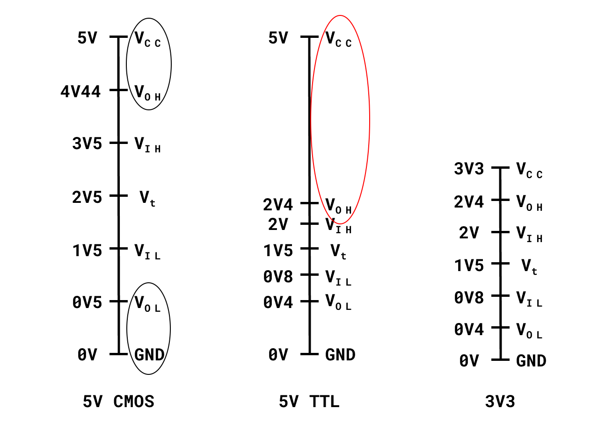

\newpage

# Dispositivi elettronici

I dispositivi dei circuiti integrati sono fatti principalmente in silicio (S) o in germanio (Ge)
o in qualche lega come GaAs, GaN, InP, SiC, ovvero materiali con 3/4/5 elettroni nell'orbitale
esterno. Questi materiali sono chiamati semiconduttori.

Accanto ai semiconduttori servono altri materiali capaci di dotarli di conduttività selettiva:
in pratica prendiamo un semiconduttore (ad esempio il silicio) e inseriamo all'interno del suo
reticolo cristallino degli atomi di un elemento drogante. L'elemento drogante viene inserito
con un rapporto dell'ordine di $1:10{}^{10}$ (questo è il caso di un drogaggio pesante,
se no è ancora minore la quantità di elemento drogante).

Il vantaggio di inserire un elemento drogante all'interno del reticolo cristallino è che gli
altri atomi lo vedono come uno di loro solo con un elettrone in più o in meno. Il drogaggio può
essere **di tipo P** se l'elemento drogante ha un elettrone in meno rispetto al semiconduttore
(ad esempio se drogo il silicio con il boro), oppure **di tipo N** se l'elemento drogante ha
un elettrone in più (ad esempio se drogo il silicio con il fosforo). Nel primo caso ottengo
delle lacune, nel secondo degli elettroni in eccesso.

## Giunzione P-N

Una giunzione P-N è formata da una sezione del semiconduttore drogata con un drogaggio P (con
una percentuale $N_{a}$, n. accettori) e un'altra sezione drogata con un drogaggio N (con una
percentuale $N_{d}$, n. donatori).

[image1.1]: immagini/0.jpg "Giunzione P-N" 
    ![Giunzione P-N][image1.1]{height=5%}

Queste due sezioni devono essere adiacenti, così che gli
elettroni possano migrare dalla parte drogata N a quella drogata P per formare al centro una
regione detta **regione di svuotamento** (o _depletion layer_) (dove ho riprodotto il reticolo
cristallino classico).

[image1.2]: immagini/1.png "Regione di svuotamento"
![Regione di svuotamento][image1.2]{width=68%}

Lo scopo della regione di svuotamento è impedire che altre cariche negative di N possano
fluire in P. La quantità di carica presente su ciascuna delle ”sezioni” della regione di 
svuotamento dev’essere uguale, tuttavia le dimensioni delle sezioni può essere diversa
e influenzata dalla percentuale di drogante.

[image1.3]: immagini/2.png "Grafici relativi alla regione di svuotamento"
!["Grafici relativi alla regione di svuotamento"][image1.3]{height=35%}

Affinché un elettrone "salti" la barriera deve esserci un buon motivo e questo può essere
dato fornendogli energia. La giunzione P-N permette il passaggio selettivo di cariche.

La giunzione P-N può essere utilizzata per creare un **diodo P-N**. Tale diodo prevede
l'applicazione di potenziale positivo dal lato P e negativo dal lato N in modo tale da
neutralizzare le lacune in P o da fornire elettroni alla parte della regione di
svuotamento di N.

Le componenti elettroniche cambiano stato _molto_ velocemente.

Gli elettroni che fluiscono nella p-region sono detti **minority carries** (e non fanno parte
del reticolo). Se faccio passare la corrente al contrario (quindi metto il potenziale positivo
dal lato N) impedisco il passaggio di corrente, estendo la regione di svuotamento e incremento
il campo elettrico fino ad un punto detto **di breakdown** dove la corrente fluisce normalmente.

Se il diodo è scaldato funziona meglio.

### Formule

**Forward bias**

$$I_{d}=I_{0}(e^{\frac{V_{d}}{nV_{t}}}\ -1)$$

$I_{0}$ è un valore tipo $10^{-10}$, $V_{d}$ e la ddp tra i capi del diodo, $nV_{t}$
sarà il _potenziale nativo dei diodi_ $(0.7V)$

[image1.4]: immagini/3.png "Grafico che spiega a grandi linee il comportamento di un diodo P-N al variare della differenza di potenziale"
![Grafico che spiega a grandi linee il comportamento di un diodo P-N al variare della differenza di potenziale][image1.4]{width=30%}

## Diodi particolari

### Fotodiodi

[image1.5]: immagini/4.png "I fotodiodi sono polarizzati inversamente"
![I fotodiodi sono polarizzati inversamente][image1.5]{width=50%}

I fotodiodi sono diodi la cui giunzione o è scoperta o è incapsulata in un materiale trasparente.

Se la giunzione è colpita da un fascio di protoni (che ha una certa energia) può darsi che
qualche fotone "porti via" al reticolo cristallino un elettrone così da creare una nuova coppia
elettrone-lacuna e far passare corrente.

La corrente che scorre nel diodo non dipende dalla tensione applicata ai suoi capi ma solo dal
flusso luminoso che colpisce la giunzione.

### Formule
$$
I_d = k \cdot E_{L}
$$

FIGURA 

$k$ è una costante che ci dice il produttore del diodo, $E_L$ è il flusso luminoso (in
$W /m^2$) che incide sul fotodiodo.

### Led

I led (light emitting diode) sono anch'essi diodi la cui giunzione è impacchettata in un
involucro trasparente. La loro barriera non si trova a $0.7V$ ma bensì a **$1.5V$**.

\begin{align*}
E&=h\cdot\nu\ (E = \text{energia emessa}, h = \text{costante di Plank}, \nu = \text{frequenza
dell'onda luminosa})\\
\nu&=\frac{E}{h}\ \Longrightarrow\ \nu\propto E \\
\lambda\nu&=c, \quad \lambda\propto\frac{1}{E}
\end{align*}

Colori diversi di luce richiedono differenze di potenziale diverse: si va da un 1.5V per un led
rosso (possiamo avere anche meno con un led IR) a un 3.0V per un led viola (e poi sale nel caso
dei led UV).

I led bianchi sono led ultravioletti ricoperti di una miscela di fosfori (ne esistono di tre
tipi: rossi, blu e verdi) in una certa proporzione tale da simulare la luce calda, quella
"neutra" o quella fredda.

La luce viene emessa perché gli elettroni che si trovano ad uno stato energetico più alto
"saltano" verso uno stato più basso e perdono energia in forma luminosa.

### Diodi Schottky

I diodi Schottky sono diodi in cui la parte P è sostituita con un metallo (solitamente
alluminio). Nella parte metallica non si può creare la regione di svuotamento. La tensione di
soglia è circa 0.3-0.4V. I vantaggi di questo diodo sono che da freddo si comporta bene come
un diodo "normale" scaldato, si spegne velocemente e passa rapidamente da conduzione diretta
a conduzione inversa. \newline
Viene utilizzato dove e un problema avere 0.7V di caduta, quindi tipo nei circuiti di potenza
o nei circuiti logici.

[image1.6]: immagini/6.png "Grafico che spiega a grandi linee il comportamento di un diodo Schottky in relazione ad uno non Schottky"
![Grafico che spiega a grandi linee il comportamento di un diodo Schottky in confronto ad un non Schottky][image1.6]{width=50%}

## Leggi di Kirchoff

1. La somma delle correnti in un nodo è 0 
2. La somma delle tensioni lungo un percorso chiuso è 0

## BJT: giunzione n-p-n (transistor bipolare)

[image1.7]: immagini/7.png "Schema di un transistor bipolare (NJT)"
![Schema di un transistor bipolare][image1.7]{width=50%}

N.B.:  la base è molto stretta così che la corrente possa passare senza problemi.

Ci sono 4 regioni di funzionamento:

1. cutoff (quando il transistor e spento) 
2. attiva diretta
3. saturazione 
4. attiva inversa

- **Cutoff**: Il dispositivo è spento (come se fosse un interruttore aperto), perciò 
$$V_{be}\ {\rm e}\ V_{bc}<V_{th},\ I_{b}=0,\ I_{c}=0$$

- **Attiva diretta**: Si ha quando $V_{be}>V_{th}$
e quindi $I_{b}>0,\ I_{c}=h_{fe}I_{b}$, ($h_{fe}$ è una funzione di guadagno).
Figura 1.8

- **Saturazione** 
\begin{gather*}
V_{be}>V_{th},\ V_{ce}<V_{ce-sat}\ \Longrightarrow\ V_{bc}>V_{th} \\
I_{b}>0,I_{c}<h_{fe}I_{b}
\end{gather*}

- **Attiva inversa** 
\begin{gather*}
V_{be}<0,\ V_{bc}>V_{th} \\
I_{e} =-I_{b}\ (\text{il gain è }\leq 1)
\end{gather*}

[image1.9]: immagini/9.png "Schema fisico di un BJT"
![Schema fisico di un BJT][image1.9]{width=20%}

## Sonda 10x
[image1.10]: immagini/10.png "Schema di una sonda 10x"
![Schema di una sonda 10x][image1.10]{width=60%}

*Bandwidth limit*: un tastino sull'oscilloscopio che taglia le frequenze sopra i 20MHz.

## Diodo Zener

[image1.11]: immagini/11.png "Schema di un diodo Zener"
![Schema di un diodo Zener][image1.11]{width=50%}

Questo tipo di diodo lavora in breakdown. Se lo metto in polarizzazione diretta funziona come un
diodo normale, se però lo metto in polarizzazione inversa faccio si che la tensione di breakdown
sia molto precisa e quindi se $V_{G}<V_{Z}$ non succede nulla ($V_{G}=V_{0}$). Se invece
$V_{G}\geq V_{Z}$ allora il diodo va in breakdown e inizia a scorrere corrente in esso. Di
preciso scorre $V_{0}=V_{Z}$ (e quindi ho una tensione in uscita stabilizzata).

Nel circuito in figura 1.11 la resistenza e importante perché se non ci fosse avrei
$\frac{V_{G}-V_{i}}{R}=i_{r}$ ma $R\to 0$ e quindi $i_{r}\to\infty$.

## BJT pnp

Questo dispositivo è complementare al npn: le equazioni sono le medesime ma il verso delle
correnti e delle tensioni è inverso.

[image1.12]: immagini/12.png "Schema di un transistor pnp"
![Schema di un transistor pnp][image1.12]{width=50%}

Rispetto al npn, il pnp ha un gain minore e quindi funziona
peggio (per questo motivo, quando e possibile, si utilizzano gli npn), ovvero scorre meno corrente
(ha un'efficienza di circa la metà degli elettroni).

## Fototransistor

La corrente di base viene generata quando è esposto alla luce, per il resto è un transistor
normale.

$I_{C}=k\cdot P_{L}$

$P_{L}$ e la potenza luminosa.

È importante che il dispositivo sia in regione attiva e quindi inserisco un resistore dal lato
del collettore per evitare di andare in saturazione.

[image1.13]:immagini/13.png "Schema di un fototransistor"
![Schema di un fototransistor][image1.13]{width=50%}

## Mos

MOS è una sigla che sta per **metallo**, **ossido** e **semiconduttore** e sono indica dei
dispositivi controllati dalla differenza di potenziale presente tra due suoi terminali. Una
particolarità di questa tecnologia è il non utilizzo della giunzione.

### N-Mos

[image1.14]:immagini/14.png "Schema di un N-MOS"
![Schema di un N-MOS][image1.14]{width=70%}

Questo dispositivo ha tre terminali: source, gate e
drain. Se siamo in corrente continua allora la corrente che scorre nel gate è 0, altrimenti,
data la forma a condensatore, scorre una piccola quantità di corrente.

Quando la tensione $V_{GS}$ è poca il dispositivo è come se fosse spento e quindi tra la parte
p e sia il source che il drain è come se ci fosse un diodo (con capo positivo in p e negativo
nei terminali) che impedisce il passaggio di corrente. Poi, via via che aumento la tensione sul
gate, gli elettroni presenti nella parte p vengono attirati vicino all'ossido (perché è così
che funziona un condensatore) fino a che il campo elettrico è così forte che gli elettroni
sono talmente schiacciati tra di loro che è come se ci fosse un canale tra il source e il drain.

Questo dispositivo non può andare in breakdown perché tra la parte metallica e p c'è uno
strato isolante.

[image1.15]:immagini/15.png "SGD"
![SGD][image1.15]{width=50%}

**Regioni di lavoro**

* cutoff: $V_{GS}<V_{t}$, in questa regione il dispositivo e come spento
perché non ho il canale di conduzione 
* regione lineare: questa regione, nei bjt,
corrisponde alla regione di saturazione. In questa regione ho poca corrente e il
dispositivo lavora come un resistore controllato in tensione. $V_{GS}>V_{t},\
I_{D}=\frac{V_{DS}}{R_{DS}}<I_{D-SAT}$. $\frac{1}{R_{DS}}\propto V_{GS}$.
* regione di saturazione: in questa regione la corrente è costante $$I_{D}
= K[2(V_{GS}-V_{t})V_{DS}-V_{DS}^{2}]$$ $$I_{D-SAT} = K(V_{GS}-V_{t})^{2}\ \text{quando}\
V_{DS}\leq V_{GS}-V_{t}$$ $$K = \frac{1}{2}\mu C_{ox}\frac{W}{L}$$ dove $\mu$ dovrebbe essere la
mobilità del materiale (quindi quanto facilmente scorrono le cariche al suo interno), $C_{ox}$
la capacità dell'ossido per unita di carica, $W$ è la larghezza della zona che va a costituire il
canale e L la sua lunghezza.

[image1.16]:immagini/16.png "Grafico N-MOS"
![Grafico N-MOS][image1.16]{width=50%}

All'aumentare della corrente il N-MOS si comporta come un resistore la cui resistenza è data
da $R=\frac{\rho\cdot L}{s}$ (s non so cosa sia).

Non posso realizzare dispositivi troppo piccoli perché canali di dimensioni ridotte supportano
tensioni più basse (o meglio posso ma devo utilizzare tensioni minori).

### P-MOS

[image1.17]:immagini/17.png "Schema di un P-MOS"
![Schema di un P-MOS][image1.17]{width=50%}

Al contrario dell'N-MOS qui devo attirare le lacune. Le equazioni sono le stesse, solo tensioni e
correnti hanno il segno invertito ($V_{GS}<0,V_{DS}>0,V_{t}<0$). Solitamente questo dispositivo
ha un gain minore perché le lacune hanno mobilità ridotta del 50% rispetto agli elettroni
dei N-MOS.

Nei N-MOS reali la source viene rivestita di un metallo per metterla in cortocircuito con p,
così che "venga scavallato" il **body diode** che c'èra prima. Adesso l'unico body diode
rimanente è quello da p al drain.

Per valutare K date delle curve e possibile risolvere il seguente sistema:
$$
\begin{cases}
I_{D1}=K(V_{G1}-V_{t})^{2}\\
I_{D2}=K(V_{G2}-V_{t})^{2}\end{cases}\longrightarrow\begin{cases}\sqrt{I_{D1}}=\sqrt{K}(V_{G1}-V_{t})\\
\sqrt{I_{D2}}=\sqrt{K}(V_{G2}-V_{t})
\end{cases}
$$

# Algebra booleana

Lo scopo di un circuito logico è quello di trasferire e processare informazioni. Esistono tre
porte principali: not, and, or.

Ogni funzione logica può essere scritta come combinazione delle porte not e una delle seguenti:
or, and, nor, nand. In particolare, se scegliamo nor e nand, possiamo rappresentare qualsiasi
circuito logico utilizzando solo una di queste due perché se mettiamo in entrambi gli ingressi
della porta lo stesso ingresso, l'uscita e un _banale_ not.

## Parametri

### Parametri statici

Ogni famiglia logica ha dei parametri statici:

* $\mathbf{V_{iH}},\ \mathbf{V_{iL}}$ sono tensioni di ingresso, $V_{iH}$ e il minimo
valore della tensione tale per cui la famiglia percepisca il livello logico "alto". $V_{iL}$
è invece il valore massimo della tensione affinché la famiglia percepisca il livello logico
"basso". Spesso questi due valori sono diversi e quindi nel mezzo c'è una zona dove il produttore
non ci garantisse se il circuito segnerà alto o basso.
* $\mathbf{V_{oH}},\ \mathbf{V_{oL}}$ sono rispettivamente il minimo valore di output che si ha quando viene generato un livello logico
alto e il massimo valore di output che si ha quando viene generato un livello logico basso.
* $\mathbf{I_{iH}},\ \mathbf{I_{iL}}$ sono rispettivamente la corrente assorbita dalla porta
quando gli viene presentato in ingresso un input alto e quando l'input è ad un livello logico
basso.	
* **Noise margin** è la quantità cui il segnale eccede la soglia minima $V_{iH}$ e
$V_{iL}$. Come noise margin si prende il minimo tra il noise margin relativo al livello alto e
a quello basso: $$NM_{H} =V_{oH}-V_{iH}$$ $$NM_{L} =V_{iL}-V_{oH}$$ $$NM =\min(NM_{L},NM_{h})$$
più NM è alto, meglio è perché vuol dire che il sistema e meno sensibile al rumore.  
* **Fan out** è il numero massimo di porte a cui può essere connesso una certa porta mantenendo
il livello logico corretto.  
* **Static power** è la potenza dissipata in condizioni statiche:
$P=(P_{H}+P_{L})/2$, $P_{H}=V_{cc}\cdot i_{H}$ (è la corrente che entra dal terminale
attaccato all'alimentazione), $P_{L}=V_{cc}\cdot i_{L}$.

### Parametri dinamici

Questi invece sono parametri che riguardano la famiglia logica durante la commutazione.

* **Ritardo di propagazione**: sono due tempi $tp_{HL}$ e $tp_{LH}$ che indicano rispettivamente
il tempo necessario per passare dallo stato alto a quello basso e viceversa. Normalmente non sono
uguali e quindi si considera come "delay" il tempo maggiore.
* **Delay-power product**: solitamente data una certa tecnologia questo prodotto è costante
e quindi è possibile aumentare la potenza per ridurre il delay. Questo e possibile perché
normalmente il delay e causato dai condensatori, che necessitano che passi loro attraverso una
certa quantità di carica prima di commutare(?), e quindi aumentando la potenza aumento anche la
quantità di corrente che passa nel condensatore e quindi si scarica/carica più velocemente. $$\text{Delay}\cdot\text{Potenza}=DP$$ 
* **Energia di commutazione**: è la quantità di energia necessaria per eseguire una commutazione. Grazie a questo valore è possibile il consumo di potenza di un certo dispositivo.

## Famiglie logiche

### RTL (resistor-transistor logic)

Questa famiglia logica (rappresentata in figura) funziona come una porta NOT

[image2.1]:immagini/18.png "Porta NOT"
![Porta NOT][image2.1]{width=40%}

Tuttavia i suoi parametri non sono ottimali e infatti non viene più usata(?)"
Se su 2.1 viene messa una corrente $I_{N}=0$ allora ho il transistor in interdizione, quindi
non passa corrente e quindi $I_{C}=0$. Conseguentemente $V_{out}=5V-R_{C}\cdot I=5V$.

Se invece viene applicata una tensione di 5V riesco a mandare in saturazione il transistor e
quindi in $V_{out}$ ho una tensione molto bassa, tipo 0.2V.

Il circuito del RTL completo (quindi che rappresenta una porta NOR) prevede anche un'altra parte:

[image2.2]:immagini/19.png "Porta NOR"
![Porta NOR][image2.2]{width=45%}

La cui relativa tabella di verità è
$$
\begin{array}{cc|c}\text{A}&\text{B}&\text{NOR}\\\hline0&0&1\\0&1&0\\1&0&0\\1&1&0\end{array}
$$
Se entrambi gli ingressi sono 0 allora entrambi i transistor sono interdetti e quindi l'uscita
$V_{out}$ è altra. Se invece almeno uno è in saturazione la famiglia logica ha come uscita
un livello basso perché la corrente a questo punto scorre anche nel transistor.

### TTL (transistor-transistor)

[image2.3]:immagini/20.jpg "Porta NOT (base)"
![Porta NOT (base)][image2.3]{width=50%}

Se l'ingresso è 5V vado in regione attiva inversa (conseguentemente ho un guadagno basso) e
quindi nel collettore passa praticamente solo la corrente di base. Il problema dell'assorbimento,
con questa famiglia logica, si presenta quando il transistor viene acceso (però è di grandezza
minore perché qui il transistor è già in saturazione, inoltre la porta funziona in modo più
predicibile).Un altro vantaggio è che $Q_{1}$ rimuove le minority carriers da $Q_{2}$ durante
la transizione LH. Di contro resta una resistenza di pullup che serve per attirare tanta corrente.
\newline
Quindi è stata pensata una versione **enhanced** del not (in realtà poi c'è la versione
enhanced della enhanced).

[image2.4]:immagini/21.jpg "Porta enhanced NOT"
![Porta enhanced NOT][image2.4]{width=50%}

La caratteristica di questa porta è che c'è un invertitore che permette di funzionare bene sia
quando l'uscita è alta che quando è bassa. Il **phase splitter** serve a creare due segnali
"opposti" che spengono/accendono $Q_{4}/Q_{2}$.

$Q_{2}$ viene spendo grazie alla resistenza da 1k.

Il problema di questa porta è che l'uscita HL è poco ripida, quindi è possibile aggiungere
un altro transistor.

[image2.5]:immagini/22.jpg "Porta enhanced${}^{2}$ NOT"
![Porta enhanced$^{2}$ NOT][image2.5]{width=30%}

Questa porta (ma anche le altre) sono fatte con transistor NPN. L'**active pull down** è un dispositivo che serve a svuotare $Q_{2}$ rapidamente. Con questa porta
viene sincronizzata l'accensione di $Q_{2}-Q_{3}$ e quindi la pendenza della funzione di
transizione aumenta (questo è merito di aver aggiunto $Q_{5}$). La resistenza RC da 130 serve
per ridurre la corrente che passa quando, durante la commutazione, sia $Q_{2}$ che $Q_{4}$
sono chiusi e quindi la corrente va verso la massa. Aggiungere un nuovo transistor è stata una
scelta molto buona perché questa porta e sia più veloce dell'altra ma consuma anche meno
(questo accade perché nell'intervallo di tempo tra l'input che e andato a 0 e l'output che
sale a 1 (circa 10ns) il circuito assorbe corrente; grazie al transistor questa finestra di
tempo e quasi dimezzata e quindi anche la corrente assorbita e minore).

Con TTL è più facile implementare un NAND:

[image2.6]:immagini/23.jpg "Porta NAND. In pratica è un NOT ma dove $Q_1$ ha due o più emettitori"
![Porta NAND. In pratica è un NOT ma dove $Q_1$ ha due o più emettitori][image2.6]{width=30%}

Il funzionamento della porta è il seguente: il primo dei due emettitori che collego alla terra
spegne il circuito a destra e quindi passa la corrente "da sopra". Se invece sono entrambi su
$Q_{3},Q_{5},Q_{2}$ sono accesi e quindi l'uscita è giù.

Durante le commutazioni del not, in quella HL passo da avere $Q_{4}$ e $Q_{1}$ accesi
(rispettivamente attivo e saturato) ad avere accesi $Q_{2},Q_{3},Q_{5}$, in quella LH il
contrario, ovvero ho $Q_{2},Q_{3},Q_{5}$ in saturazione e passo ad avere accesi $Q_{1}$
e $Q_{4}$.

### Logic cells

I MOS utilizzati possono essere sia a canale P che a canale N. Possono poi esserci MOS ad
arricchimento: dove applicando tensione al gate si forma il canale, o a svuotamento: dove il
canale è già formato e devo chiuderlo. Il vantaggio di utilizzare i MOS per realizzare porte
logiche è quello che permette di realizzare dispositivi molto compatti e che consumano meno.

[image2.7]:immagini/24.jpg "Invertitore CMOS"
![Invertitore CMOS][image2.7]{width=40%}

Solitamente vogliamo che i dispositivi digitali lavorino nella regione lineare (i mos) e in
saturazione (i bjt). Nel caso dei mos, quando sono in regione lineare funzionano come se fossero
delle resistenze connesse ad un interruttore (l'interruttore si apre quando il cmos è interdetto).

[image2.8]:immagini/25.jpg "Come varia l'uscita $V_{o}$ al variare dell'ingresso $V_{i}$"
![Come varia l'uscita $V_o$ al variare dell'ingresso $V_i$][image2.8]{width=50%}

La corrente di ingresso e di uscita, in un mos, in condizioni statiche, è 0.

Mi conviene che quando costruisco i dispositivi questi abbiano k uguale in modo da ottenere due
equazioni identiche (per il PMOS e il NMOS) (per questo motivo la curva in 2.8 è antisimmetrica
rispetto al centro). Facendo così il margine di rumore alto e basso sono uguali e quindi
ottimizzo le risorse della porta logica.

Le formule che indicano i vari parametri sono:
$$
\begin{aligned}&V_{iH}=\frac{1}{8}[5V_{DD}-2V_{t}]\\&V_{iL}=\frac{1}{8}[3V_{DD}+2V_{t}]\\&V_{oH}=V_{DD}\\&V_{0L}=0\\&NM_{L}=NM_{H}=NM=V_{iL}\end{aligned}
$$
Il noise margin massimo si ha quando $V_iL=V_{iH}$. Tuttavia questa condizione non è ottimale perché l'onda della transizione è poco brusca e a noi piace quando la transizione avviene rapidamente (inoltre se non è brusca passa della corrente nel circuito) e quindi le tensioni di input spesso vengono prese pari a $V_{iL}=$ $\frac{1}{3}V_{DD}$ e$V_{iH}=\frac{2}{3}V_{DD}.$
Con i MOS la tensione di alimentazioni ci interessa poco. Invece nei TTL abbiamo una tensione di soglia fissa da abbattere (0.7V). Con i MOS è possibile lavorare sui parametri quando lo andiamo a costruire e farne uno con un canale più corto e che quindi lavora con tensioni più basse (e che ovviamente è più piccolo).
Con CMOS è possibile sia fare un NOR che un NAND.

[image2.9]:immagini/26.jpg "NOR fatto con tecnologia CMOS."
!["NOR fatto che tecnlogia CMOS"][image2.9]{width=50%}

Ecco un confronto tra TTL e CMOS:

\begin{table}
\centering
\begin{tabular}{|>{\centering\hspace{0pt}}m{0.444\linewidth}|>{\centering\arraybackslash\hspace{0pt}}m{0.458\linewidth}|}
\multicolumn{1}{>{\centering\hspace{0pt}}m{0.444\linewidth}|}{TTL}                      & \multicolumn{1}{>{\centering\arraybackslash\hspace{0pt}}m{0.458\linewidth}}{CMOS}                              \\ 
\hhline{|==|}
Alimentazione 5V                                                                        & Alimentazione variabile \par{}(la porta può essere alimentata con tensioni diverse)                            \\ 
\hline
$V_i:0.9V-1.4V$\par{}~(i valori commerciali sono $0.8V-2V$)                             & $V_i:\frac{1}{3}V_DD-\frac{2}{3}V_DD$                                                                          \\ 
\hline
$V_oL:0.2V$ trans. in saturazione \par{}$V_oH:3.6V$ diodo, trans. e resistenza in serie & $V_oL:$ resistenza del canale NMOS \par{}$V_oH$ resistenza del canale PMOS \par{}(circa 10$\Omega$ ciascuna)   \\ 
\hline
bias currents e input currents \par{}contribuiscono alla dissipazione della potenza     & corrente assorbita pari a 0 (in condizione statica)\par{}~(a volte capita di avere consumo statico purtroppo)  \\
\hline
\end{tabular}
\end{table}

### BiCMOS

A volte vogliamo poter combinare sia i vantaggi di CMOS (alta integrazione e consumo di potenza
statica basso) con quelli dei circuiti bipolari.

[image2.10]:immagini/27.jpg "Invertitore fatto con tecnologia BiCMOS."
!["Invertitore fatto con tecnologia BiCMOS"][image2.10]{width=50%}

Questo sopra ha un'uscita compatibile con i CMOS, ma nel caso volessimo avere un'uscita compatibile
TTL la cosa migliore da fare è utilizzare input TTL compatibili (e in uscita un totem pole).

## Logica combinatoria e sequenziale

- Logica combinatoria: una funzione logica è statica nel tempo e non ha memoria. $y=f(x)$.
- Logica sequenziale: può essere descritta da due funzioni combinatorie: $y_{n}=f_{1}(x,M_{n})$
e $M_{n+1}=f_{2}(x_{n},M_{n})$. $M_{n}$ e la memoria del sistema allo stato $n$. \newline Il segnale con cui il sistema passa da $n$ a $n+1$ e il **clock**. Una caratteristica della logica
sequenziale è che a ingressi uguali (in istanti di tempo diversi) possono corrispondere uscite
diverse.

L'elemento di memoria utilizzato è il flip-flop D.

## Latch SR 

[image2.11]:immagini/28.png "Latch Set-Reset"
![Latch Set-Reset][image2.11]{width=50%}

Gli ingressi sono "bassi attivi" (se messi a 0 sono accesi).
$$
\begin{array}{ccccc}\overline{S}&\overline{R}&Q_{new}&\overline{Q_{new}}\\\hline1&1&Q_{old}&\overline{Q_{old}}&\text{hold}\\0&1&1&0&\text{set}\\1&0&0&1&\text{reset}\\0&0&1&1&\text{combinazione proibita}\end{array}
$$
L'ultima combinazione è necessario evitarla per due motivi:

1. perché nel passaggio da 00 a 11 lo stato che avrà il latch dipenderà dallo stato in cui
transita (e praticamente impossibile cambiare due bit insieme)
2. se costruisco il circuito considerando Q e $\overline{Q}$ con valori opposti e
hanno entrambe 1 si introduce un errore

(se ho un ingresso ad 1 sulla porta NAND allora viene fatto il not dell'altro ingresso, se
invece ho uno 0 l'uscita e per forza 1).

Nelle FPGA è proibito sintetizzare la funzione logica dei latch.

## Positive edge triggered flip flop (DFF, flip flop di tipo D)

[image2.12]:immagini/29.png "È un flip flop D. I due NAND più a destra sono un latch SR."
![È un flip flop D. I due NAND più a destra sono un latch SR.][image2.12]{width=30%}

$$
\begin{array}{ccccc}
C&D&Q_{new}&\overline{Q_{new}}\\
\hline0&\text{x}&Q_{old}&Q_{old}&\text{hold}\\
1&\text{x}&Q_{old}&\overline{Q_{old}}&\text{hold}\\
\uparrow&0&0&1&\text{reset}\\
\uparrow&1&1&0&\text{set}
\end{array}
$$
Nel momento in cui il clock sale si presenta una configurazione che dipende dal dato.

Per vedere nello schema come funziona la transizione, ad esempio $\uparrow$ con D=0, prima
calcolo C=0 e D=0, poi metto C=1 e vedo come cambia l'output.

## Circuiti integrati commerciali

I circuiti logici possono essere implementati:

* con i flip flop 
* con le logiche programmabili (tipo FPGA) 
* circuiti integrati con il circuito logico preciso stampato sopra

È necessario che gli oggetti appartenenti a queste categorie possano dialogare tra di loro e si
dice che appartengono alla stessa famiglia logica se ciò avviene. Tanti anni fa per progettare
sistemi digitali si utilizzavano:

* porte logiche 
* flip flop 
* buffers 
* adders 
* counters

Oggigiorno si usano le FPGA (che hanno migliaia di porte logiche e che si programmano con un
linguaggio di programmazione un po' simile all'assembler). I motivi perché non si utilizzano
i circuiti _vecchio stampo_ sono:

* così i PCB hanno dimensioni ridotte 
* si riducono correnti parassite 
* è possibile avere velocità maggiore 
* si hanno minori consumi

In un sistema digitale c'è quasi sempre:

* qualcosa di programmabile 
* glue logic (raccordi tra varie componenti del sistema fatti con porte logiche) 
* front-end ICs (tipo convertitore A/D e D/A oppure con funzioni I/O) 
* clock system 
* power control

Il packaging dei circuiti integrati determina la quantità di spazio occupato e quanti effetti
parassiti ci sono.

Il primo packaging inventato era il **DIP** (dual in line): corpo in resina con a destra e a
sinistra dei piedini (through-hole, ovvero che passano attraverso la scheda). La distanza tra
un piedino e l'altro è di $\frac{1}{10}$in (2.54cm). Sono così grandi perché le macchine
che assemblavano i circuiti integrati non potevano lavorare con oggetti più piccoli di questi. \\
Successivamente sono stati sostituiti dai **SMD** (surface mounted device), che nella forma
sono simili ai DIP solo che la distanza tra i piedini e massimo massimo 50mils (1 mils = 0.001
in) (50mils = 1.27mm) ma se no è meno. Questo vuol dire che sono più piccoli e quindi hanno
meno induttanza e conduttanza parasite. Inoltre a parità di piedini occupano $\frac{1}{4}$
volte l'area che occuperebbe un DIP. I piedini dei SMD sono da appoggiare sulla superficie del
circuito e saldarli.
Questi si usano ancora oggi.

Dopo (una ventina d'anni fa) sono stati inventati i **BGA** e gli **LGA**, rispettivamente
_ball grid array_ e _land grid array_. I primi hanno delle palline di stagno sotto il chip
e queste servono per essere saldate (con dei forni). I secondi hanno tanti aggegetti, sempre
sotto il chip, come ad esempio i processori (così che poi possono essere messi su un "aggancio"
apposito che ha tanti pin).

\begin{figure}[h]
\centering
  \begin{subfigure}[b]{0.2\textwidth}
    \includegraphics[width=\textwidth]{immagini/30.png}
    \caption{[DIP: Dual In-line Package}
  \end{subfigure}
  \hspace{0.02\textwidth}
  \begin{subfigure}[b]{0.2\textwidth}
    \includegraphics[width=\textwidth]{immagini/31.jpg}
    \caption{SMD: Surface Mounted Device}
  \end{subfigure}
  \begin{subfigure}[b]{0.2\textwidth}
    \includegraphics[width=\textwidth]{immagini/32.jpg}
    \caption{[BGA: Ball Grid Array}
  \end{subfigure}
  \hspace{0.02\textwidth}
  \begin{subfigure}[b]{0.2\textwidth}
    \includegraphics[width=\textwidth]{immagini/33.jpg}
    \caption{LGA: Land Grid Array]}
\end{subfigure}
\caption{Diversi circuiti integrati}
\end{figure}

Poi c’è una tecnologia che consiste nel prendere il chip senza packaging e schiaffarlo
direttamente sul circuito. Questa opzione si chiama bare die e si utilizza se è 
necessario/possibile risparmiare anche sul packaging perché vengono
prodotti miliardi di dispositivi tutti uguali (come ad esempio per gli orologi a muro). \newline
A volte alcuni SMD hanno i pin su 4 lati. \newline 
La distanza tra le palline dei BGA può variare tra 1.27mm e 0.4mm. 
Nonostante i BGA abbiano un sacco di palline è difficile che siano montati male
e che quindi ci siano problemi di cortocircuito tra le varie palline (quindi è un
packaging molto buono). È possibile mettere le palline direttamente sul silicio 
e quindi fare un misto tra BGA e SMD (solitamente questa cosa funziona se ho pochi pin).

## Famiglie logiche standard

Le famiglie TTL sono solo a 5V per ragioni costruttive.

* TTL/L*S TTL o low power Schottky (obsoleta) 
* ALS advanced low power Schottky, consuma la metà e va il doppio più veloce (in disuso anche questo)
* F fast (consuma un po' ma va parecchio veloce)

Tra tutte e tre le logiche TTL, l'unica che un po' si utilizza ancora è la F (quando dobbiamo
gestire tanta corrente in uscita).

Poi ci sono i CMOS:

* CMOS alimentati con tensione 5-15V (MOLTO delicati, tipo che se uno ha un maglione e li prende in mano si rompono) 
* AHC advanced high speed CMOS (vanno a 5V) 
* AC advanced CMOS (anche questi vanno a 5V)

Anche se può sembrare strano AC ha delle prestazioni migliori di AHC. AC è molto veloce ma
consuma anche molto (quando effettua le commutazioni).

Oggigiorno i CMOS consumano meno (perché lavorano con meno tensione).

Se abbasso la tensione di una porta progettata per lavorare con tensioni più alte (sono stupido)
riesco a far funzionare la porta lo stesso ma avrò una minore velocità. La cosa più saggia da
fare se voglio utilizzare meno tensione è scegliere una porta che è stata progettata proprio
per lavorare con la tensione che desidero.

Poi ci sono altre famiglie un po più moderne:

* LV, LVC low voltage CMOS (sono general purpose) 
* ALVC, AVC advanced low voltage CMOS (permettono di avere una velocità molto elevata) 
* (A)LVT advanced low voltage BiCMOS (performance buona, consumo basso, si accende con 0.7V)

Attualmente si utilizzano LVC e BiCMOS.

### Nomenclature delle porte logiche

La nomenclatura standard prevede:

1. produttore 
2. 74 = circuiti commerciali, 54 = circuiti militari (la differenza è che i circuiti militari sono garantiti per funzionare anche in situazioni più estreme)
3. famiglia logica 
4. funzione che svolge (e quindi e possibile sapere anche che porte ci sono dentro)
5. package 
6. a volte c'è anche scritto il range di temperatura a cui lavora

Esempio:

$$\underbrace{SN}_{1}\underbrace{74}_{2}\underbrace{AC}_{3}\underbrace{00}_{4}-
\underbrace{xxx}_{5}$$

### Comparazione tra famiglie logiche

Per effettuare una comparazione tra le famiglie logiche si può compararle in base alle
performance:

* velocità di commutazione 
* consumo di potenza (questo varia in base alla frequenza) 
* quanto è potente lo stato di uscita = fan out

La velocità, in una certa famiglia, è strettamente legata (inversamente proporzionale) al
consumo di potenza.

Le famiglie BiCMOS il consumo di potenza è elevato (possono essere utilizzate in caso mi serva
elevata corrente d'uscita).

## Come si imposta l'input

[image2.14]:immagini/34.png "Il circuito A, quando è accesa l’uscita è a 0V, quando è spento è a $V_{CC}$. Il circuito B è il contrario"
![Il circuito A, quando è accesa l’uscita e a 0V, quando è spento e a $V_{CC}$. Il circuito B è il contrario][image2.14]{width=40%}

Queste due configurazioni sono uguali solo quando $I_{iH}$ e $I_{iL}$ sono uguali (e quindi
nei CMOS). Per i circuiti TTL è meglio utilizzare il circuito A perché così non ho cadute
di tensione dovute a $I_{iL}$.

## Cosa fare con i piedini non utilizzati

I piedini CMOS non utilizzati sono un bel problema perché hanno un'impedenza molto alta
(siccome sono isolati) e quando sono sconnessi possono caricarsi con della tensione variabile
tra 0 e quella di alimentazione $V_{dd}$ (infatti, data la resistenza molto alta, basta una
corrente bassissima per avere una tensione interessante). Questo causa la rottura del circuito
perché PMOS e NMOS sono in conduzione e quindi passa corrente per tanto tempo.

I possibili rimedi sono:

* collegare il pin alla massa
* collegare il pin all'alimentazione
* collegare il pin alla massa con una resistenza nel mezzo (tra il pin e la massa) così da rendere il pin più facile da utilizzare se un giorno cambiassi idea sul suo utilizzo

Per i TTL se l'ingresso (emitter del BJT) è scollegato è come se fosse "alto" e quindi non ci
sono troppi problemi. Al massimo posso inserire una resistenza di pull-up (che tira il segnale
ancora più in alto).

Un motivo per cui i circuiti vengono programmati con i segnali di controllo attivi bassi è
perché, se si rompe un pin, la funzione smette di essere eseguita.

Ogni output deve garantire livelli "basso" e "alto" corretti:
\begin{align*}
V_{OHmin}&>V_{iHmin}\\V_{OLmax}&<V_{iLmax}
\end{align*}
Quando uno legge i dati relativi al circuito potrebbe leggere i valori tipici (che sono la
media del processo in condizioni controllate), il valore massimo e il valore minimo: le cose
interessanti e importanti sono solo le ultime due.

Quando progetto devo utilizzare il **worst case design**: devo progettare considerando i valori
peggiori.

{width=35%}
{width=35%}

TTL e CMOS

Per rendere compatibili CMOS 5V e TTL si può introdurre un pull-up come in figura 2.21. $R_{p}$
deve essere tale da non superare un certo limite imposto dalla porta quando ha uscita bassa.

[image2.22]:immagini/37.png "TTL con pull-up"
![TTL con pull-up][image2.22]{width=50%}

Se $R_{p}$ è grande allora la porta "si beve" molta corrente; tuttavia più è grande la
resistenza, minore è il consumo di potenza in condizioni statiche.

Però c'è anche il problema che più prendo grande la resistenza più ci mette il circuito
a commutare tra due livelli. Quindi la cosa migliore da fare e prendere una resistenza
nell'intervallo identificato dai calcoli espressi qui sotto che permetta al circuito di commutare
nel tempo desiderato.

[image]:immagini/38.png "Calcolo"
![][image]{width=50%}

[image2.15]:immagini/39.png "A sinistra c'è una porta TTL con uscita alta, a destra con uscita bassa."
![A sinistra c'è una porta TTl con uscita alta, a destra con uscita bassa][image2.15]{width=50%}

|        | I_{OH} max (mA) | I_{OL} max (mA) |
|:------:|:---------------:|:---------------:|
|  LS00  |       -0,4      |       +16       |
|   F00  |        -1       |       +20       |
|  F244  |       -15       |       +64       |
|  AHC00 |        -8       |        +8       |
| LVC244 |       -24       |       +24       |

Tabella: I TTL sono asimmetrici in correnti di uscita mentre i CMOS hanno output simmetrici.

L'uscita dei TTL funziona meglio quando è "bassa" perché ha una corrente maggiore "e quindi
si vede meglio". Questo è il secondo motivo per cui i segnali di controllo sono attivi bassi.

Per le famiglie CMOS non c'è alcun motivo per cui continuare ad utilizzare segnali attivi
bassi se non perché "si è sempre fatto così".

## Datasheet

Le info sulle porte logiche sono sul datasheet. Queste info sono:

* funzionalità 
 tipo di package
* absolute maximum ratings (limiti entro i quali il dispositivo e garantito che non si rompa) 
* recommended operating conditions (i limiti entro i quali il dispositivo funziona correttamente) 
* specifiche elettriche (valori tipo $V_{OH}$ in relazione a $I_{OH}$ e $V_{CC}$ 
* caratteristiche dinamiche (tipo $t_{pd}$ (=t${}_{\text{propagation delay}}$)
    che è espresso da un range e dipende molto dalla $V_{CC}$, quindi se aumento $V_{CC}$ il
    $t_{pd}$ diminuisce; se nel foglio non sembra così probabilmente è diverso il carico con cui
    sono stati svolti gli esperimenti e magari con tensioni maggiori sono stati usati condensatori
    maggiori per simulare dispositivi più vecchi)

Nella prima pagina dello sheet ci sono le informazioni più importanti (però di solito conviene
leggere anche le pagine dopo). Input transition rate con max a 5ns/V vuol dire che se ci metto
più di 5ns per V a fare la commutazione friggo il circuito.

$C_{i}$ è la capacità dell'ingresso (più nello specifico del gate). Tale capacità influenza
anche la resistenza di pullup che posso mettere: il $\tau$ relativo al condensatore è pari
al transmission rate $\times V_{CC}$, se faccio $\tau/C$ ottengo il valore massimo della
resistenza di pullup che posso utilizzare senza avere problemi.

## Scariche elettrostatiche

Se scarichiamo su di un circuito lo rompiamo (a meno che questo non sia progettato opportunamente
per evitare tale evenienza).

Le cariche elettrostatiche si accumulano in luoghi poco umidi (quindi è necessario tenere
l'umidità della stanza intorno al 50%). Noi possiamo accumulare diversi kV e questa tensione
può rompere il gate. Inoltre più è piccolo il dispositivo, maggiore è la sensibilità.

È possibile modellare varie cose del mondo reale come circuiti così che sia possibile testare se
un circuito resista alle scariche elettrostatiche provenienti da tale ente. Ad esempio esistono
modelli dell'uomo, delle macchine industriali e di altri dispositivi carichi.

[image2.16]:immagini/40.png "Human body model"
![Human body model][image2.16]{width=30%}

Il costruttore poi potrebbe utilizzare dei diodi in modo tale da evitare che le scariche effettuate
sul componente siano fatali o potrebbe utilizzare transistor con $V_{\text{breakdown}}$ maggiore.

Noi invece siamo tenuti a maneggiare correttamente i dispositivi, mettersi il braccialetto
antistatico, usare una superficie di lavoro debolmente conduttiva che scarica a terra e evitare
un ambiente di lavoro troppo secco (e troppo umido).

Nel datasheet ci sono le specifiche con cui è stato testato il dispositivo contro le ESD.

## Consumi di potenza durante la commutazione

All'aumentare della frequenza di commutazione aumenta anche la potenza assorbita. Di solito le
famiglie più veloci assorbono più potenza.

Nei TTL il consumo è dato da:

* statico $\rightarrow$ bias current 
* dinamico $\rightarrow$ cross-conduzione (quando i transistor del totem pole sono entrambi in conduzione)

Nei CMOS invece è dato da:

* statico $\rightarrow\approx 0$ 
* dinamico $\rightarrow$ capacità parassita del circuito integrato, capacità dei circuiti che ci metto fuori e in minor parte (tipo che le altre cause
consumano dalle 3 alle 5 volte più potenza rispetto a questa) la cross conduzione.

Nelle famiglie low voltage logic circuit il consumo è molto minore.

La **potenza dissipata da una capacità alla frequenza di clock** è:

$$P=\frac{1}{T}\int_{0}^{T}i_{0}(t)\cdot V_{o}(t)dt$$

Per l'onda quadra vale $i_{0}=i_{p}=C_{L}\cdot\frac{dV}{dt}$ e quindi l'integrale diventa
facilmente

\begin{align*}
\int_{0}^{T}i_{0}(t)\cdot V_{o}(t)dt &=\int_{0}^{T}C_{L}\cdot\frac{dV}{dt}\cdot V_{o}(t)dt=\int_{0}^{V_{DD}}C_{L}\cdot V_{0}dV\\
&=\frac{1}{2}V_{DD}^{2}C_{L}
\end{align*}

Che poi (facendo delle magie e delle considerazioni che posso considerare il circuito come una
resistenza e una capacità(??)) diventa

$$P=C_{L}V_{DD}^{2}f_{0}$$

Da questa formula si può notare che la potenza è direttamente proporzionale
alla frequenza e proporzionale al quadrato rispetto a VDD.
Se diminuisco la tensione di alimentazione di metà, la potenza di dissipazione
decresce di 4 volte.
Quindi conviene tenere la tensione di alimentazione bassa.
Se il circuito è fatto da più capacità allora la potenza complessiva è
$$
P_{TOT}=\sum_{n}(C_{L_{n}}\cdot f_{0n})\cdot V_{DD}^{2}
$$
Nei CMOS dobbiamo considerare sia la capacità parassita interna $(C_{pd})$, sia
quelle esterne $(C_{L})$.Solitamente $C_{pd}$  è scritta sul datasheet.
$C_{pd}$ aumenta con la complessità del circuito e diminuisce con l'avanzare della
tecnologia.

In circuiti più complessi i CMOS sono così piccoli che un po'di corrente passa
sempre (in condizioni statiche) (si hanno delle leakage currents).
Per gestire la temperatura dei chip si può:
* variare la tensione e la frequenza con cui lavora per diminuire i consumi 
* se il chip non viene utilizzato o viene spento togliendogli l'alimentazione
o gli viene tolto il clock (così da consumare solo in modo statico)
* start&stop (tipico dei sistemi embedded dove il dispositiwo prima è in idle,
poi si sveglia per fare il suo e poi torna in idle)
* termal throttling (il dispositivo va al massimo fmo a quando non arriva
alla temperatura limite e poi diminuisce la potenza per restare a tale 
temperatura, ovviamente le prestazioni sono ridotte) (questa cosa è tipica
delle GPU e SSD)

## Convertitori
I convertitori servono per trasformare segnali analogici in segnali continui e
viceversa. Questi sfruttano i concetti di **quantizzazione** e **campionamento**.
* **Campionamento**: A intervalli regolari misuro il valore assunto dal segnale continuo e suppongo che questo mantenga tale valore per tutta la durata dell’intervallo.
* **Quantizzazione**: I campioni vengono sostituiti con il valore del **livello di
quantizzazione** più vicino. La **risoluzione** è il numero di bit con cui viene quantizzato il segnale.

### Principali formati digitali

$$\begin{array}{c|c|c|c}V_{in}&\text{Binary}&\text{Offset binary}&\text{2's compl.}\\\hline V_{fs}/2&111111&111111&011111\\+\text{dV}&000001&100001&000001\\0&000000&100000&000000\\-\text{dV}&/&011111&111111\\-V_{fs}/2&/&000000&100000\end{array}$$
Tabella 2.3: L’offset binary non è compatibile con i calcoli che utilizzano il complemento a 2

$V_{fs}$ è il range di valori ammissibili. È importante che questo valore sia dello stesso
ordine di grandezza del segnale che vogliamo convertire perché se è più piccolo chiaramente
non possiamo convertirlo per bene, mentre se è più grande abbiamo dei problemi perché è
come se sfruttassimo meno bit e quindi otteniamo meno precisione.

### Convertitori D/A

[image2.17]:immagini/41.png "Questo D/A converter non è ottimale perché richiede che i valori delle resistenze siano precisi e questi solitamente non lo sono."
![Questo D/A converter non è ottimale perché richiede che i valori delle resistenze siano precisi e questi solitamente non lo sono.][image2.17]{width=40%}

Il convertitore in figura 2.26 sfrutta un amplificatore invertente e il principio
di sovrapposizione: $V_{out}$ e $-\frac{R_{F}}{R_{G}}\cdot V_{in}$ dove $R_{F}$ è la
resistenza in parallelo all'amplificatore e $R_{G}$ è quella dopo l'ingresso a 5V, posso poi
calcolare i $V_{out}$ per tutte
le resistenze e trovare la tensione di uscita totale facendone la combinazione lineare

$$V_{out}=-V_{in}\cdot\left(\frac{R_{F}}{R_{G_{1}}}+\frac{R_{F}}{R_{G_{2}}}+...+
\frac{R_{F}}{R_{G_{n}}}\right)$$

Una soluzione migliore è il **R-2R converter**.

[image2.18]:immagini/42.png "R-2R converter"
![R-2R converter][image2.18]{width=50%}

Nel convertitore in figura 2.27 vengono utilizzate solo due tipologie di resistenze: una con
valore R e una che vale 2R.

Guardando ad ogni nodo da destra(?), è possibile vedere due resistenze da 2R in
parallelo, che quindi fanno una resistenza R. Inoltre è possibile notare che la corrente si
dimezzi ad ogni nodo.

La precisione di un DAC si misura con:

* **full scale error**, ovvero la differenza massima tra il valore di output ideale e quello
reale (si misura in % di $V_{fs}$) 
* **linearity error**, ovvero la differenza massima tra l'ampiezza di uno "step" reale e uno ideale

Il **tempo di campionamento** corrisponde al tempo in cui è iniziata la conversione da digitale
a analogico.

La **risoluzione** si esprime in numero di bit utilizzati.

Il segnale di output di un DAC è campionato e quantizzato.

### Convertitori A/D

È importante che il segnale in ingresso sfrutti tutta la capacità di conversione del dispositivo,
per esempio se il convertitore lavora sull'intervallo [0, 10V] e il segnale in ingresso oscilla
tra -1V e +1V quello che devo fare + spostare di +1V il segnale e poi amplificarlo di un fattore
5, così che oscilli tra 0 e 10V.

* Digital ramp ADC

[image2.19]:immagini/43.png "Digital ramp ADC"
![Digital ramp ADC][image2.19]{width=50%}

In questo tipo di convertitore viene utilizzato un comparatore che ha output 1 se gli ingressi
sono uguali e 0 se sono diversi. Nel contatore viene messo il valore convertito. La conversione
avviene gradualmente fino ad un certo punto dove il segnale in uscita diventa 0, a quel punto
la conversione è completata. \newline
Il principale problema di questo convertitore è che per completare una conversione richiede
fino a $2^{N}$ colpi di clock.

* Successive approx. ADC

[image2.20]:immagini/44.png "Successive approximation ADC - 12 "
![Successive approximation ADC - 1][image2.20]{width=40%}

[image2.21]:immagini/45.png "Successive approximation ADC - 2 "
![Successive approximation ADC - 2][image2.21]{width=40%}

La struttura di fondo è la medesima di quella prima, solo che adesso la conversione
avviene utilizzando un algoritmo di bisezione. In questo modo divido lo spazio in 2 ad ogni
passo. Il numero di colpi di clock per completare una conversione è N.

* Flash ADC

Questo convertitore è molto bello perché produce l'output in un colpo di clock. Questa cosa
è possibile perché vengono messe in parallelo le varie informazioni. Tuttavia ho bisogno di
$2^{N}$ comparatori e questi occupano diverso spazio sul silicio e quindi posso lavorare solo
con pochi bit di uscita.

{width=40%}
{width=50%}
\begin{figure}[!h]
\begin{subfigure}[t]{0.4\textwidth}
\caption{Flash ADC}
\end{subfigure}
\hfill
\begin{subfigure}[t]{0.6\textwidth}
\caption{Come viene effettuato il campionamento}
\end{subfigure}
\end{figure}

Nel ADC flash il campionamento avviene quando metto il dato nel registro. Nel SAR tale momento si
ha quando ho finito l'ultima conversione mentre il tempo di conversione è il tempo di esecuzione
dell'algoritmo di conversione. \newline
Nei digital ramp il momento di campionamento + quando "l'uscita diventa 0", il tempo di
conversione è variabile.

# Microprocessori, microcontrollori, etc.

Ci sono tanti tipi di dispositivi programmabili: microcontrollori, microprocessori, GPU, FPGA, ecc.

Le FPGA sono il dispositivo più a basso livello (si manipolano i singoli bit), gli altri sono
ad un livello più alto.

Le GPU contengono migliaia di core (che magari sono meno potenti della singola CPU però sono
comunque migliaia). Le FPGA contengono milioni di porte logiche.

## Definizioni

* Microprocessore: un single chip processing unit (tipo l'8086) e richiede la ram, l'interrupt
controller (dispositivo che sotto certe condizioni cambia l'ordine di esecuzione del programma
generando delle interruzioni che chiamano delle funzioni specifiche per gestire l'evento, ad
esempio la pressione di un tasto), il DMA controller (che si occupa di spostare dati tra le
varie zone di memoria, solitamente della sua gestione se ne occupa il sistema operativo), il
clock e lo UART (che non so cosa sia). Al giorno d'oggi, interrupt controller e DMA controller
sono incorporati nel processore.
* Microcontrollore: E anche questo un single chip processing unit (solitamente meno potente di un
microprocessor al fine di consumare meno) autonomo (quindi non gli servono clock, ram, memoria
flash, PIC, DMA, ecc. esterni, perché sono tutti integrati al suo interno).

Il DMA controller del microcontrollore, di solito (quando manca il SO), deve essere programmato
da noi.

## Requisiti di un microcontrollore

* **Esecuzione predicibile del codice**: è facile sapere quanto tempo ci metterà a eseguire il
codice 
* **RISC/CISC con poche istruzioni** 
* **Architettura Harward**: l'architettura Harward
prevede che dal processore partano due bus, uno verso la memoria dati e uno verso la memoria
programma. Al contrario l'architettura di Von Neumann prevede che ci sia un solo bus che collega le
memorie alla CPU 

[image3.1]:immagini/48.png "Architetture a confronto"
![Architetture a confronto][image3.1]{width=40%}

* Possibilità di comunicare con il mondo esterno mediante
    * GPIO: pin che possono essere impostati come ingresso o come uscita a piacimento
    * Mixed signal peripherals (ADC/DAC): permettono un controllo lineare (tipo mediante gli amplificatori)* 
    * Periferiche di comunicazione che implementano le interfacce di comunicazione
    * Numerical control interface (PWM, pulse width modulation): permettono un controllo di altri dispositivi con meno sprechi rispetto al controllo lineare
    * Tempi di reazione agli eventi esterni molto rapido**

* Aside sui motori elettrici: Se volessi controllare in velocità un motore elettrico potrei:
a. Dare la potenza giusta affinché si muova con una certa velocità
b. Dare per una frazione di secondo la potenza massima erogabile, poi stare fermo per un tot e ripetere questo finché ne ho bisogno

L'opzione B è quella più efficace perché limita la potenza persa sull'amplificatore

[image3.2]:immagini/49.jpg "Opzione B"
![Opzione B][image3.2]{width=50%}

Poi vogliamo che il dispositivo sia piccolo e che consumi **poco**.

## Schede

Le schede solitamente hanno il processore e basta. A volte hanno anche una parte per fare il
debug del codice direttamente su di essa. Per esempio Arduino UNO è del primo tipo, la scheda
che abbiamo in laboratorio (STM qualcosa) è del secondo.

Poi esiste una porta (**porta JTAG**) che serve per accedere ai registri e alla memoria flash
(quindi per caricare il programma là sopra) del microcontrollore. Questa porta può essere
utilizzata anche per bloccare l'esecuzione del codice.

Sulla scheda c'è un dispositivo che serve a bloccare ingressi e uscite al fine di evitare
comportamenti strani in fase di accensione/spegnimento (perché la corrente passa da 0 al valore
che deve assumere (o viceversa) e normalmente i dispositivi non sono garantiti che funzionino
correttamente al di fuori dei valori presenti sul datasheet).

Di default, all'accensione, le uscite della scheda non sono configurate. Per assicurarmi di
non incorrere in comportamenti non desiderati è consigliabile aggiungere un pull up/pull down
così anche da preservare il circuito (magari i mos si attivano e passa un sacco di corrente
e poi si rompono).

* Cortex-M4 (F4): è il microcontroller installato sulle schede che abbiamo in laboratorio.
Utilizza architettura Harvard, e CISC, ha molte periferiche, consuma pochino (100$\mu$A/MHz)
e ha l'unità floating point (FPU).

La FPU è un modulo della CPU che permette di eseguire operazioni in virgola mobile senza
utilizzare una libreria che le simuli (l'utilizzo della libreria è molto oneroso in termini
di cicli di clock). La precisione della FPU è la precisione singola (32 bit). Non tutte le
schede sono dotate di questo modulo (ad esempio Arduino UNO ne è sprovvisto). Per qualche
motivo non è detto che il compilatore della nostra scheda utilizzi gli OPCODE floating point
(bisogna stare attenti a quale usa).

Su questa scheda non bisogna fare le divisioni perché manca il divisore hardware, quindi se
dobbiamo dividere per delle costanti possiamo semplicemente moltiplicare per il suo reciproco,
altrimenti calcolare una volta il reciproco del valore da dividere e poi utilizzare quello.

Alcuni GPIO hanno delle funzioni specifiche in più (tipo PWM/ADC DAC).

## Approfondimento sulla Cortex-M4

L'oscillatore (clock) interno e fatto con un not, una resistenza e un condensatore. La
precisione e dell'1% (10000 parti per milione) e la frequenza varia in base alla temperatura
e all'alimentazione. Data la precisione bassa potrebbe interessare avere un oscillatore più
preciso: in questo caso si prende un quarzo (la cui precisione va da 100ppm a molte meno ppm)
e la cui frequenza va da 1 a 50MHz.

Il segnale generato dal quarzo viene poi moltiplicato/diviso dal PLL.

[image3.3]:immagini/50.png "Cortex M4"
![Cortex M4][image3.3]{width=50%}

* **GPIO**: "Dietro" ciascun GPIO ci sono due parti: una che gestisce l'ingresso e una che gestisce
l'uscita. \newline
L'uscita è composta da due CMOS. Noi ne dobbiamo usare solo 1. Spesso potrebbe essere utile
avere una resistenza di pull up/pull down internamente (oppure un pull up esternamente, se
necessito di maggiore precisione).
Per evitare che il codice sia interrotto da un'interruzione in una zona critica non viene
utilizzato l'output data register. \newline
Al contrario si utilizza il bit set/reset register che e **interrupt safe**. \newline
Quando voglio scrivere un 1 sull'ODR metto nella parte bassa del BSRR un 1 (e poi ci pensa lui
a scriverlo nel ODR). Se invece voglio resettare un bit dell'ODR basta mettere un 1 nella parte
alta del BSRR.

### Interrupt controller

Serve a interrompere il flusso di programma per gestire un altro flusso (ISR) e poi tornare a
gestire il programma principale. L'interrupt controller reagisce a degli eventi.

Su STM32 può essere **nested/vectored**:

* nested vuol dire che le interazioni hanno una priorità e che durante l'esecuzione di una
interruzione a bassa priorità può arrivare una interruzione a priorità maggiore che passa
avanti.  
* vettorizzato vuol dire che ci sono n sorgenti di interrupt e ciascuna è collegata
ad una funzione che si trova elencata in una tabella delle interruzioni. Questa tecnica viene
utilizzata se devono essere gestite tante interruzioni diverse.

Gli usi tipici dell'interrupt controller sono:

* gestione dei GPIO 
* con i timer, ovvero viene generata una richiesta di interruzione dopo un
tot specifico di tempo. I timer possono essere utilizzati per produrre segnali periodici utili
per i sistemi di controllo (tipo PWM).

[image3.4]:immagini/51.png "Il duty cycle è dato da $\frac{D}{T}=\delta$. Maggiore è la soglia, più tempo sta alta l’onda."
[Il duty cycle è dato da $\frac{D}{T}=\delta$. Maggiore è la soglia, più tempo sta alta l’onda.][image3.4]{width=50%}
Il contatore del timer non si ferma quando fermo l'esecuzione del programma (tipo con il debugger).

NON SI FA DEBUG DI CIRCUITI DI POTENZA.

# Appendice
## Parametri RTL

* $V_{iH} = 0.75V, V_{iL} = 0.6V$ 
* $I_{iH} @ V_{iH} = 150 \mu A, I_{iH} @ 5V = 9.5mA$
* $I_{iL} = 0$
* $V_{oH} = 5V$ (no load condition) 
* $V_{oL} = 0.2V$
* $NM_{H} = 4.25V, NM_{L} = 0.4V \to NM = 0.4V$
* Fan-out: 33
* $P_{L} = 5V\times 7.5mA (Rc) = 37.5mW, P_{H} = 0, P =18mW$ 
* $t_{pHL} e $t_{pH}$ veloci per merito della resistenza in base (qualche nS) 
* $DP$ = 5nS\times 18mW = 90pJ$

Il fanout si calcola facendo: $(V_{CC}-V_{iH})/R_{C}=n\times I_{iH}($@$V_{iH})$.

### 4.2 Parametri TTL (credo il not standard con 5 transistor)

* $V_{iH} = 1.35V, V_{iL} = 1.1V$
* $I_{iH} = 15\mu A$
* $I_{iL} = 1mA$
* $V_{oH} = 3.75V$
* $V_{oL} = 0.2V$ 
* $NM_{H} = 2.4V, NM_{L} = 0.9V \to NM = 0.9V$
* $P_{L} = 5V\times(0.7mA (Rpu)+2.5mA (Rpu1)) = 16mW, P_{H} = 5V\times 1mA (Rpu) = 5mW, P=11.5mW$
* $t_{pHL}$ e $t_{pH}$ veloci per merito di Q5 e dei transistor vari(?) (circa 5 nS)
* $DP = 5nS\times 11.5mW = 57.5pJ$
